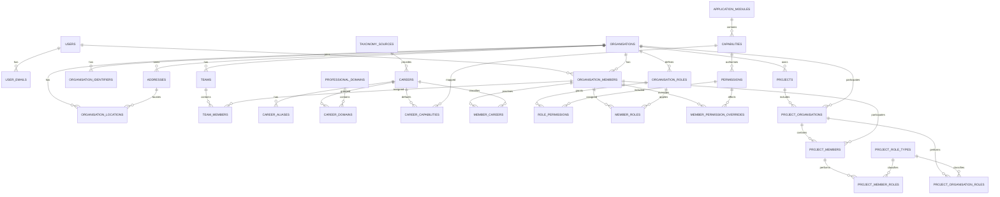

# 21 — Normalised Database Schema: Platform Kernel

## 1. Purpose

This document moves NuBlox from a conceptual data model to an implementation-level relational design for the platform kernel.

The associated executable baseline DDL is:

- `database/schema/001-platform-kernel.sql`

This is the first schema package. Later schema packages extend the kernel into CRM, sales, commercial management, procurement, documents, site operations, quality, safety, assets and facilities management.

## 2. Normalisation standard

NuBlox transactional tables target **Third Normal Form (3NF) by default**.

The design rules are:

1. **1NF** — each column contains one value from one domain; no arrays, comma-separated foreign keys or repeating groups.
2. **2NF** — non-key attributes depend on the whole candidate key.
3. **3NF** — non-key attributes depend on the key, the whole key and nothing but the key.
4. **BCNF/higher forms** — used where they remove genuine update anomalies without making the operational model unnecessarily obscure.
5. **Many-to-many relationships** — represented by associative tables.
6. **Reference data** — separated where values have their own identity, metadata or lifecycle.
7. **JSON** — not used for stable relational business facts merely to avoid schema design.
8. **Denormalisation** — requires a measured need, documented rationale and preferably an Architecture Decision Record (ADR).

Historical snapshots such as issued invoices, accepted quotations and contractual document revisions are not treated as accidental duplication. They represent facts at a point in time and must remain immutable even when master data later changes.

## 3. Tenant integrity principle

NuBlox is multi-tenant. Normalisation must not weaken tenant isolation.

Where an associative table relates two organisation-owned records, `organisation_id` may be included as part of a **composite candidate/primary key** so MySQL can enforce same-tenant foreign keys.

Example:

```text
teams
  UNIQUE (id, organisation_id)

organisation_members
  UNIQUE (id, organisation_id)

team_members
  PRIMARY KEY (organisation_id, team_id, organisation_member_id)
  FK (team_id, organisation_id) -> teams
  FK (organisation_member_id, organisation_id) -> organisation_members
```

Because every column in the associative relation is part of the key, this does not introduce a non-key transitive dependency.

## 4. Platform kernel scope

The first schema package covers:

- users and verified email identities;
- organisations;
- organisation identifiers and locations;
- organisation membership;
- teams;
- career taxonomy and aliases;
- professional domains;
- application modules;
- capabilities;
- permissions;
- organisation roles;
- member careers, roles and permission overrides;
- projects;
- project participant organisations;
- project participant members;
- business/project role types;
- audit events.

Authentication-provider-specific credential/session persistence is intentionally not frozen in this package because the authentication implementation remains an ADR/discovery decision. The `users` and `user_emails` model is provider-neutral.

## 5. ERD — platform kernel



## 6. Identity tables

### `users`

Represents a human account independently of any organisation.

Key rules:

- a user can belong to many organisations;
- disabling a user does not delete historical attribution;
- `public_id` is opaque and safe for external references;
- authentication provider details do not belong in the business profile row.

### `user_emails`

One user may have multiple email addresses.

Key rules:

- email is normalised before persistence;
- a verified email can be used for identity/recovery according to the authentication policy;
- one primary email per user is enforced by a generated constraint column in the baseline DDL;
- email history must not be copied into every organisation membership.

## 7. Organisation tables

### `organisations`

Represents the tenant/business boundary.

Core facts include:

- legal/trading name;
- default timezone;
- default currency;
- lifecycle status.

Company numbers, VAT numbers and similar identifiers are not columns on this table because an organisation can have several identifier types.

### `organisation_identifiers`

Stores typed legal/tax/registry identifiers.

Candidate key:

```text
(organisation_id, identifier_type, identifier_value)
```

### `addresses`

Addresses are tenant-owned records that can later be reused by CRM, sites, assets and other domain entities through link/role tables.

They are not globally shared between tenants.

### `organisation_locations`

Named business locations/offices linked to an address.

A composite foreign key ensures the address belongs to the same organisation.

## 8. Membership and teams

### `organisation_members`

Associates a user with an organisation.

Natural candidate key:

```text
(organisation_id, user_id)
```

The surrogate `id` remains useful for attribution and downstream relationships.

### `teams`

Organisation-owned named team/unit.

### `team_members`

Pure many-to-many relation between teams and organisation members.

Composite key:

```text
(organisation_id, team_id, organisation_member_id)
```

This permits database-enforced same-tenant membership.

## 9. Career taxonomy

### `taxonomy_sources`

Stores source-level metadata independently of individual career rows.

Initial source: National Careers Service.

### `professional_domains`

Stores the NuBlox professional-domain classification used to group reusable functionality.

### `careers`

Stores canonical careers.

The 84 National Careers Service profiles are reference data and must be seeded separately from schema creation.

### `career_aliases`

Alternative titles are separate rows rather than repeated columns such as `alias_1`, `alias_2`, `alias_3`.

### `career_domains`

Many-to-many mapping between careers and professional domains.

A career may later participate in several domains while retaining a single primary domain.

### `member_careers`

A career association is scoped to an organisation membership rather than being treated as an access-control role.

A person can therefore be an Electrician in one organisation and hold a different professional profile in another.

## 10. Capabilities and permissions

NuBlox separates three concepts:

### Career

What the person does professionally.

### Capability

What functional area/tooling exists for a career or professional pack.

Examples:

```text
commercial.measurement
electrical.testing
asset.maintenance
inspection.perform
```

### Permission

What action an authenticated member is authorised to perform.

Examples:

```text
variation.create
variation.approve
invoice.issue
member.invite
```

This separation prevents job titles from becoming security rules.

## 11. Role model

### `organisation_roles`

Tenant-owned roles such as:

- Owner
- Administrator
- Manager
- Finance/Commercial
- Professional
- Field Worker
- Read Only

### `role_permissions`

Many-to-many mapping of organisation roles to permissions.

### `member_roles`

Many-to-many mapping of organisation members to roles.

### `member_permission_overrides`

Explicit per-member allow/deny override for exceptional cases.

The authorisation engine must define precedence. Recommended baseline:

```text
explicit deny > explicit allow > role grants > default deny
```

Project/record context is then applied after organisation-level permission resolution.

## 12. Projects and cross-organisation participation

### `projects`

Every project has exactly one owning organisation.

A project number is unique within the owning organisation, not globally.

### `project_organisations`

Associates participating organisations with a project.

Natural key:

```text
(project_id, participant_organisation_id)
```

This relation represents project participation and sharing; it does not transfer ownership of the project.

### `project_role_types`

Business/project roles such as:

- Client
- Architect
- Engineer
- Quantity Surveyor
- Main Contractor
- Subcontractor
- Supplier
- Facilities/Operations

These are business-context classifications, not access-control roles.

### `project_organisation_roles`

An organisation can perform several roles on the same project.

### `project_members`

Associates specific organisation members with a participating project organisation.

Composite foreign keys ensure the member belongs to the participating organisation.

### `project_member_roles`

A person can perform several project roles.

## 13. Audit events

`audit_events` is append-oriented operational/security evidence.

It stores event context including:

- event time;
- acting user/member;
- acting organisation;
- project where relevant;
- action;
- subject type/identifier;
- correlation/request identifier;
- minimal structured change summary.

The audit record is intentionally historical/event-oriented rather than a normal mutable master-data entity. It must not be used as an uncontrolled duplicate copy of entire business records.

## 14. Delete and archive behaviour

Baseline:

| Record type | Default behaviour |
|---|---|
| User | Disable; retain attribution |
| Organisation | Suspend/archive; do not cascade-delete business history |
| Organisation member | Disable/remove active access; retain attribution |
| Team | Deactivate or delete only if safe |
| Career/reference data | Deactivate, do not remove historical links |
| Role | Deactivate when assigned/history exists |
| Project | Archive/cancel, not physical delete after material activity |
| Audit event | Retention-controlled; no ordinary user delete |

Foreign keys therefore generally use `RESTRICT` for master/history relationships and `CASCADE` only for pure dependent/associative rows where deletion cannot destroy required evidence.

## 15. Indexing rules

Indexes are driven by access paths, not added to every column.

Baseline patterns:

- tenant-scoped indexes begin with `organisation_id` when appropriate;
- public IDs are unique;
- junction-table primary keys support both integrity and common joins;
- additional reverse-direction indexes are added where MySQL cannot efficiently satisfy reverse lookups from the primary key;
- status/date indexes are added after concrete query design;
- indexes must be reviewed against write volume and cardinality.

## 16. Public identifier proposal

The baseline DDL uses:

```sql
public_id CHAR(36) CHARACTER SET ascii COLLATE ascii_bin
```

The application should generate opaque UUIDs, preferably time-sortable UUIDv7 when the chosen Node/TypeScript library is approved.

This is deliberately separate from the internal `BIGINT UNSIGNED` primary key.

Before the first production migration, this choice should be frozen in an ADR. A switch to `BINARY(16)` is possible if the development company demonstrates clear operational benefit and supplies safe conversion/query helpers.

## 17. Date/time rule

Event timestamps are stored in UTC using `DATETIME(6)`.

Business dates that are not instants — for example an invoice date or contract date — should use `DATE` in their domain schema rather than an artificial midnight timestamp.

IANA timezone identifiers remain configuration data for display/scheduling.

## 18. Character/collation rule

Business text uses `utf8mb4`.

Opaque identifiers and machine keys use ASCII/binary-sensitive collations where appropriate.

Search-specific collation behaviour must be designed per field rather than relying on the server default.

## 19. Next schema packages

After the platform kernel, build in this order:

1. `002-crm-parties.sql`
2. `003-sales-quotes.sql`
3. `004-contracts-finance.sql`
4. `005-procurement.sql`
5. `006-workforce-time-scheduling.sql`
6. `007-project-information-documents.sql`
7. `008-site-quality-safety.sql`
8. `009-commercial-cost-control.sql`
9. `010-assets-maintenance.sql`

Each package must include:

- ERD changes;
- DDL;
- normalisation review;
- tenancy review;
- key/constraint review;
- delete/archive semantics;
- critical queries/indexes;
- migration notes;
- acceptance tests for integrity constraints.
