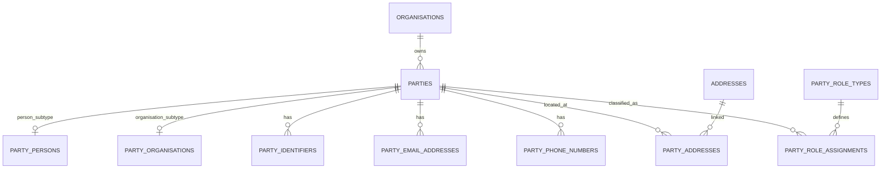
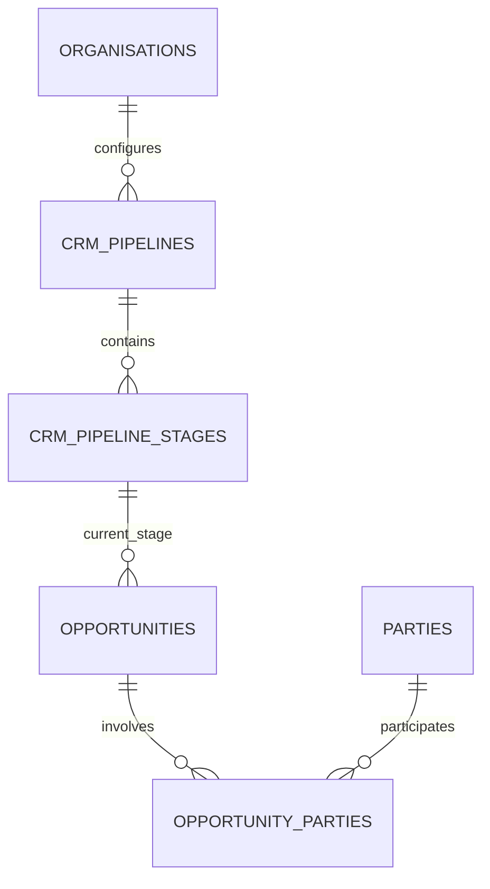

# 22 — CRM and Party Domain Model

## 1. Purpose

This specification defines NuBlox Schema Package 002: the normalised CRM/party model used to represent people and organisations that a tenant does business with.

The primary design rule is:

> **A real-world party is stored once per NuBlox tenant and may hold many business roles.**

A company must not need duplicate records because it is simultaneously a client, supplier, subcontractor and consultant. Likewise, a person must not be duplicated because they are a contact for several opportunities or activities.

## 2. Tenant boundary

CRM parties are **tenant-owned records**.

If the same external contractor is known to two different NuBlox organisations, each tenant maintains its own private CRM record unless a later NuBlox Network feature explicitly links identities with controlled consent and sharing rules.

This avoids creating an unintended global customer/contact directory and protects private relationship data.

## 3. Normalisation target

The CRM transactional model targets **3NF by default**.

The model separates:

- party identity;
- person-specific attributes;
- organisation-specific attributes;
- business roles;
- external identifiers;
- communication methods;
- postal/physical addresses;
- organisation/person contact relationships;
- party-to-party relationships;
- sales pipelines/stages;
- opportunities;
- CRM activities;
- tags/classification.

No table contains comma-separated role IDs, contact IDs, addresses or tags.

## 4. Core party model



### `parties`

The supertype stores only attributes common to every CRM party:

- tenant ownership;
- public identifier;
- party kind discriminator;
- account/relationship owner;
- lifecycle status;
- audit timestamps.

### `party_persons`

Stores person-specific naming attributes.

A job title or department is **not** stored here because those are properties of a person's relationship with an organisation, not intrinsic attributes of the person.

### `party_organisations`

Stores organisation-specific naming attributes.

Registration numbers, VAT/tax numbers, professional registration numbers and similar identifiers are stored in `party_identifiers`, not as proliferating nullable columns.

## 5. Business roles

A party may have zero or more role assignments.

Initial roles include:

- prospect;
- client;
- supplier;
- subcontractor;
- consultant;
- developer;
- main contractor;
- authority;
- landlord;
- tenant;
- insurer;
- funder;
- manufacturer;
- merchant.

The structure is:

```text
party
  ↓
party_role_assignments
  ↓
party_role_types
```

This deliberately avoids separate `clients`, `suppliers`, `subcontractors` and `consultants` master tables containing duplicate names and addresses.

Domain-specific extensions may later reference a party with a required role. For example a future supplier account table can reference `party_id` without recreating the supplier's identity data.

## 6. Person ↔ organisation contact relationships

A person working for or representing an organisation is modelled by `party_organisation_contacts`.

```text
Person Party
     ↓
party_organisation_contacts
     ↓
Organisation Party
```

Relationship attributes belong on this junction:

- job title;
- department;
- primary-contact flag;
- start/end date.

This permits one person to:

- represent more than one organisation;
- change jobs without losing history;
- hold different titles in different relationships.

## 7. Generic party relationships

`party_relationships` handles relationships that do not belong to the contact/employment model, for example:

- parent company;
- subsidiary;
- joint venture partner;
- trading-as relationship;
- landlord/tenant relationship;
- referral relationship.

The relationship is directional: `source_party_id → target_party_id` with a controlled relationship type.

## 8. Contact data

Email addresses and phone numbers are separate child tables because each party can have several values.

### Email

Stores:

- email;
- label/type;
- primary flag;
- verification state where NuBlox has actually verified the address.

### Phone

Stores:

- E.164-form number where available;
- extension;
- label/type;
- primary flag.

A generated-column uniqueness pattern limits each party to one primary email and one primary phone while permitting multiple non-primary values.

## 9. Addresses

Package 001 already defines tenant-owned `addresses`.

Package 002 therefore uses `party_addresses` as a relationship between a party and an address.

This allows the same normalized address entity to be referenced where appropriate while the relationship carries business meaning such as:

- registered;
- trading;
- billing;
- postal;
- office;
- home;
- service.

The relationship supports validity dates so an address change does not require destruction of prior relationship history.

## 10. Party identifiers

`party_identifier_types` and `party_identifiers` support identifiers such as:

- Companies House/company registration number;
- VAT/tax number;
- DUNS or other commercial identifier;
- professional/accreditation identifier where appropriate.

An identifier records its type and issuing country/authority context where available.

It must not be used as a general key/value dumping table. Only well-defined identifier concepts belong here.

## 11. CRM pipeline model



A tenant may configure multiple pipelines.

A stage belongs to one pipeline. The database uses a composite foreign key so an opportunity cannot reference a stage from a different pipeline or tenant.

## 12. Opportunities

An opportunity stores the sales/commercial event, not the customer's identity.

Party participation is represented through `opportunity_parties`.

This supports an opportunity involving:

- primary prospective customer;
- named customer contacts;
- consultant;
- referrer;
- decision maker;
- other relevant parties.

Only one participant may be flagged as the primary party for an opportunity.

Opportunity monetary values use `DECIMAL(19,4)` and an explicit ISO currency code.

## 13. CRM activities

`crm_activities` stores communication/activity records such as:

- note;
- phone call;
- email;
- meeting;
- site visit;
- follow-up;
- other CRM event.

Activities can link to:

- an opportunity;
- zero or more external parties;
- zero or more internal organisation members.

Participants use junction tables rather than repeated columns such as `contact_1`, `contact_2`, etc.

## 14. Tags

Tags are tenant-defined classifications.

```text
crm_tags
   ↓
party_tags
   ↓
parties
```

Tags are not substitutes for core business roles or schema fields. They are for optional classification/search only.

## 15. Party subtype invariant

Every `parties` row has a `party_kind` of `person` or `organisation` and must have exactly one matching subtype row:

- `person` → one `party_persons` row and no `party_organisations` row;
- `organisation` → one `party_organisations` row and no `party_persons` row.

MySQL foreign keys enforce tenant ownership of the subtype, but the exclusive-subtype invariant spans tables and therefore must also be enforced in the domain service and covered by database integration tests. A trigger-based implementation may be considered, but application services must not rely on the browser to enforce it.

## 16. Deduplication

NuBlox should provide duplicate warnings, but automatic merging must be conservative.

Potential matching signals:

- organisation legal/trading name;
- registration identifiers;
- email addresses;
- phone numbers;
- postal addresses;
- person name + organisation relationship.

A merge operation is a material/audited workflow because it changes references from many records.

## 17. Data minimisation

The CRM model deliberately does not add broad personal-data fields such as date of birth, national identifiers or sensitive personal characteristics by default.

Additional personal data should only be introduced when there is a defined product purpose, access model and retention basis.

## 18. Deletion and archival

A party referenced by commercial/project history should normally be archived rather than physically deleted.

Issued contractual/financial documents may preserve historical party snapshots in later schema packages. Those snapshots are historical facts and must not be rewritten when the live CRM party changes.

## 19. Search/display names

Canonical names remain in the subtype tables:

- person name components in `party_persons`;
- legal/trading name in `party_organisations`.

The first implementation should compose display/search names in queries/application services. A persisted search projection may be added later only if measured search requirements justify it; this prevents premature duplicate name storage.

## 20. Tables in Package 002

1. `party_role_types`
2. `party_identifier_types`
3. `party_relationship_types`
4. `opportunity_party_role_types`
5. `crm_activity_types`
6. `parties`
7. `party_persons`
8. `party_organisations`
9. `party_identifiers`
10. `party_email_addresses`
11. `party_phone_numbers`
12. `party_addresses`
13. `party_role_assignments`
14. `party_organisation_contacts`
15. `party_relationships`
16. `crm_tags`
17. `party_tags`
18. `crm_pipelines`
19. `crm_pipeline_stages`
20. `opportunities`
21. `opportunity_parties`
22. `crm_activities`
23. `crm_activity_parties`
24. `crm_activity_members`

## 21. Package acceptance criteria

Package 002 is acceptable when automated MySQL integration tests demonstrate:

- a party cannot reference another tenant's organisation member as owner;
- person/organisation subtype rows cannot cross tenant boundaries;
- party roles are many-to-many without duplicated party identity;
- a contact relationship cannot cross tenant boundaries;
- party addresses cannot reference another tenant's address;
- one party can have several emails/phones but only one primary of each;
- pipeline stages cannot be used by opportunities in another pipeline/tenant;
- opportunity-party links cannot cross tenant boundaries;
- CRM activity participant links cannot cross tenant boundaries;
- tenant A cannot retrieve tenant B CRM records through direct IDs.
