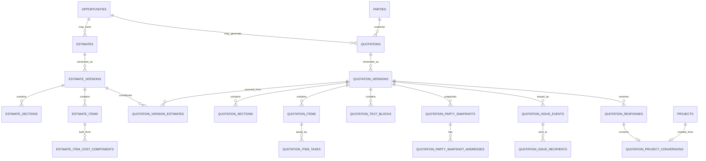

# 23 — Sales, Estimates, Quotations and Proposals

## 1. Purpose

This specification defines NuBlox Schema Package 003: the normalised sales/pricing domain used to move work from a CRM opportunity into a costed estimate, customer-facing quotation/proposal, commercial response and project/job conversion.

The primary flow is:

```text
Opportunity
   ↓
Estimate
   ↓
Estimate Version
   ↓
Cost Components / Sell Rates
   ↓
Quotation
   ↓
Quotation Version
   ↓
Issue Event
   ↓
Customer Response
   ↓
Accepted Work
   ↓
Project / Job
```

## 2. Normalisation target

The transactional schema targets **3NF by default**.

The model deliberately separates:

- reusable units of measure;
- sales item classifications;
- tenant tax categories and time-effective tax rates;
- reusable catalogue items and time-effective catalogue prices;
- logical estimates from estimate versions;
- estimate output items from their internal cost components;
- logical quotations from quotation versions;
- quotation sections, items, tax snapshots and narrative blocks;
- issue events from issue recipients;
- customer responses from the quotation/version itself;
- accepted quotation responses from project conversion.

No comma-separated lists, repeated `item_1`, `item_2` fields or JSON item arrays are permitted for stable commercial structures.

## 3. Historical snapshots are intentional

Normalisation does **not** mean an issued commercial document may change when master data changes later.

When a quotation version is issued, NuBlox must preserve the facts that formed that document, including where applicable:

- customer/contact display details;
- address details;
- line descriptions;
- quantities and units;
- unit rates;
- tax category/rate applied;
- taxable amount and rounded tax amount;
- narrative scope, assumptions, exclusions and terms;
- issue recipients;
- issue time and issuing member.

This is deliberate historical snapshotting, not uncontrolled duplication.

## 4. Reference model

### Units of measure

`units_of_measure` is global reference data such as:

- item;
- hour;
- day;
- metre;
- square metre;
- cubic metre;
- kilogram;
- tonne;
- litre;
- lump sum.

A quote line references a unit rather than storing arbitrary repeated unit text.

### Sales item types

`sales_item_types` classifies cost/sales content:

- labour;
- material;
- plant;
- subcontract;
- service;
- professional fee;
- other.

These classifications can be reused across trades and professions.

### Tax

Tenant-controlled tax data is split into:

```text
tax_categories
   ↓
tax_category_rates
```

A category represents treatment/meaning; its percentage is time-effective reference data.

Example:

```text
Standard VAT
├── 20.0000% from date A to date B
└── future rate from date B onward
```

Historical quotations do not recalculate from the current tax-rate row. Applied rates are snapshotted on the quotation item.

## 5. Sales catalogue

The catalogue is optional.

```text
sales_catalog_items
   ├── sales_item_type
   ├── unit_of_measure
   ├── default_tax_category
   └── sales_catalog_item_prices
```

A catalogue item is reusable master data. Estimate and quotation lines copy/snapshot the commercial facts that apply to their version so changing the catalogue later does not rewrite historical documents.

Prices are stored as time-effective rows by:

- item;
- price type (`cost` or `sell`);
- currency;
- validity period.

No single mutable `current_price` is required on the catalogue master record.

## 6. Estimate model

An estimate is a logical pricing record. Revisions are versions.

```text
estimates
   ↓
estimate_versions
   ├── estimate_sections
   └── estimate_items
          ↓
      estimate_item_cost_components
```

### Estimate versus estimate version

`estimates` owns stable identity/context:

- tenant;
- estimate number;
- opportunity/project context;
- title;
- lifecycle state.

`estimate_versions` owns revision-specific facts:

- version number;
- currency;
- version state;
- created/finalised information.

This avoids overwriting prior pricing revisions.

### Estimate item

An estimate item represents the customer-facing/work-output item being priced.

Example:

```text
Install distribution board
Quantity: 1 item
Sell unit rate: £X
```

### Cost components

Internal build-up is separately normalised:

```text
Install distribution board
├── Labour: 8 hours × cost rate
├── Material: distribution board × cost rate
├── Material: protective devices × cost rate
└── Plant/other components as required
```

A cost component may reference a catalogue item but keeps its own version-specific description, quantity and cost rate.

This supports estimators, trades, contractors and consultants without creating career-specific estimate tables.

## 7. Quotation/proposal model

A quotation is a logical commercial document; each revision is a `quotation_version`.

```text
quotations
   ↓
quotation_versions
   ├── quotation_version_estimates
   ├── quotation_sections
   │      └── quotation_items
   │             └── quotation_item_taxes
   ├── quotation_text_blocks
   ├── quotation_party_snapshots
   │      └── quotation_party_snapshot_addresses
   └── quotation_issue_events
          └── quotation_issue_recipients
```

### Logical quotation

Stable context includes:

- tenant;
- quotation number;
- opportunity (optional);
- existing project/job (optional);
- customer party;
- primary contact party (optional);
- owner;
- lifecycle status.

### Quotation version

Version facts include:

- revision number;
- title/subject;
- currency;
- customer reference;
- valid-until date;
- draft/superseded/withdrawn lifecycle;
- lock time after issue.

An issued version is immutable through normal application operations.

### Source estimates

`quotation_version_estimates` is a junction table because one quotation version may be composed from one or more estimate versions, and an estimate version may be used in more than one quotation scenario.

### Sections and lines

Quote sections are optional and ordered.

Quote items contain:

- ordered line number;
- optional source estimate item;
- optional catalogue item;
- description;
- quantity;
- unit;
- unit rate;
- optional flag.

The item does **not** reference a mutable catalogue price as the authoritative issued amount.

## 8. Tax snapshots

`quotation_item_taxes` permits one or more applied tax components per line.

It stores the issue/version-specific:

- tax category;
- applied rate percentage;
- taxable amount;
- rounded tax amount.

The taxable/tax amounts are historical calculation facts required to reproduce the issued document exactly, including rounding.

## 9. Quotation totals

Do not persist ordinary editable header-level `net_total`, `tax_total` and `gross_total` merely for convenience.

They are derived from the immutable quotation-version lines and tax snapshots.

If production performance later requires cached/materialised totals, that is a deliberate denormalisation and must be documented in an ADR with invalidation rules.

## 10. Narrative content

`quotation_text_blocks` stores ordered typed content such as:

- scope;
- assumptions;
- exclusions;
- clarifications;
- terms;
- notes.

This is preferable to adding ever-growing nullable columns to the quotation header.

Templates may be introduced later, but the issued version preserves the rendered text as a historical fact.

## 11. Party snapshots

The master CRM party remains linked to the logical quotation, but each quotation version can snapshot the identity/contact/address facts used on that document.

This prevents a later client address/name/contact update from rewriting an old quotation.

Snapshot rows may retain `source_party_id` for traceability, but the snapshot itself is authoritative for the issued version.

## 12. Issue model

Issuing a quotation is an event, not just a date column.

```text
quotation_issue_events
   ↓
quotation_issue_recipients
```

This supports:

- first issue;
- reissue of the same locked version;
- multiple recipients;
- email/portal/manual delivery;
- issue history;
- audit evidence.

The first successful issue locks the quotation version.

## 13. Response model

Customer responses are event records:

`quotation_responses`

Types include:

- accepted;
- rejected;
- revision requested;
- withdrawn by customer.

A generated unique key prevents more than one accepted response for the same logical quotation.

The responding CRM party may be linked where known, while respondent name/email can also be snapshotted as response evidence.

## 14. Effective quotation status

To avoid storing the same business fact in several places, user-facing status is resolved from version lifecycle, responses and dates.

Typical logic:

1. `draft` — version lifecycle is draft.
2. `accepted` — quotation has an accepted response for that version.
3. `rejected` — applicable response is rejected and no later accepted response exists.
4. `superseded` — version lifecycle is superseded.
5. `withdrawn` — version lifecycle is withdrawn.
6. `expired` — issued/locked, valid-until is in the past, and no acceptance exists.
7. `issued` — locked/issued and none of the above applies.

This effective status should be implemented in domain/query logic and covered by tests.

## 15. Quote-to-project conversion

Accepted work is linked through:

`quotation_project_conversions`

The conversion references the accepted response and resulting project/job.

The conversion operation must be transactional and idempotent:

1. verify response is `accepted`;
2. verify tenant and permission context;
3. create or select the target project/job;
4. create conversion row;
5. link originating opportunity/quotation in application domain data;
6. write audit/outbox events;
7. commit.

Repeated requests must not create duplicate projects.

## 16. Project tenant integrity

Package 003 adds a composite candidate key to `projects`:

```text
(project.id, project.owning_organisation_id)
```

This enables later schema packages to use composite foreign keys that prove a referenced project belongs to the same tenant.

## 17. ERD — sales core



## 18. Required application/domain invariants

Not all business rules can be expressed with straightforward MySQL foreign keys/checks. Application services and integration tests must enforce:

- an estimate/quotation opportunity belongs to the same tenant;
- an estimate/quotation project belongs to the same tenant;
- a `primary_contact_party_id`, when used as contact, is normally a person party;
- catalogue price validity periods for a given item/type/currency do not overlap;
- tax-rate validity periods for a category do not overlap;
- a final estimate version is immutable through normal write APIs;
- an issued/locked quotation version is immutable;
- quotation sections/items/taxes cannot be added to a locked version;
- response `accepted` can occur only for an issued/locked version;
- accepted response uniqueness is respected under concurrent requests;
- conversion can only reference an accepted response;
- quote-to-project conversion is idempotent;
- all calculations use decimal arithmetic with an explicitly defined rounding policy;
- permissions such as quote issue/acceptance recording/conversion are server-enforced.

## 19. Calculation policy

The implementation must use decimal arithmetic throughout.

Binary floating-point must not be used for authoritative monetary calculations.

The domain service must define and test:

- line extension rounding;
- tax rounding level;
- percentage precision;
- currency minor-unit behaviour;
- optional-line inclusion;
- document total aggregation.

The selected policy must be versionable if future jurisdictions require different behaviour.

## 20. Next dependency

Schema Package 004 can now build contracts and finance against stable parties, accepted quotations and projects:

```text
Accepted Quotation
   ↓
Contract / Appointment
   ↓
Invoice / Credit
   ↓
Payment Status
```
