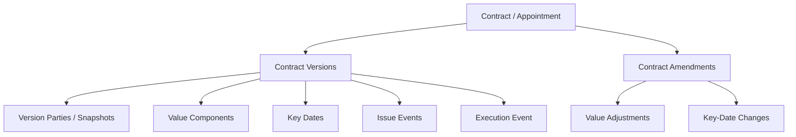
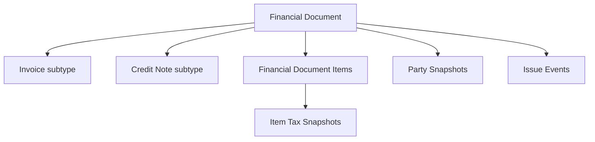
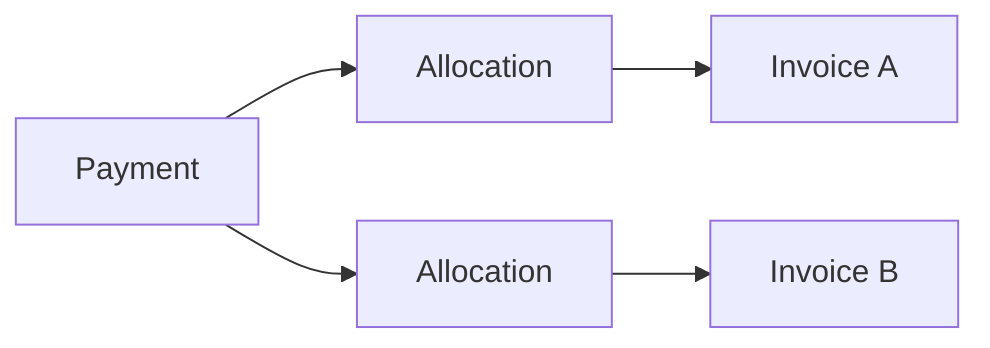

# 24 — Contracts and Finance Domain Model

## 1. Purpose

This specification defines NuBlox Schema Package 004: contracts/appointments and the operational accounts-receivable finance model.

It depends on:

- `001-platform-kernel.sql`
- `002-crm-parties.sql`
- `003-sales-quotes.sql`

The package is designed for **3NF by default** and preserves immutable commercial facts once a contract or financial document is issued/executed.

## 2. Scope boundary

Package 004 covers:

- client contracts and professional appointments;
- contract versions and issue/execution evidence;
- contract parties;
- base contract value components;
- key contract dates;
- controlled contract amendments;
- customer billing settings;
- invoices;
- credit notes;
- invoice/credit-note line items and tax snapshots;
- issue events and recipients;
- payments;
- payment allocation to invoices;
- controlled reversal of payments/allocations.

Package 004 does **not** create a statutory general ledger, bank-reconciliation engine, VAT return engine, payroll system or full accounts-payable ledger. Those are separate product decisions/integration concerns.

## 3. Governing accounting/data rule

> **Issued financial documents are immutable commercial facts. Corrections are new controlled records, not edits to history.**

Examples:

- correcting an issued invoice uses a credit note and, where necessary, a replacement invoice;
- correcting a recorded payment uses a reversal record;
- correcting an allocation uses an allocation-reversal record;
- contract changes after execution use a controlled amendment rather than overwriting the executed baseline.

## 4. Contract model



### 4.1 Logical contract vs version

`contracts` is the stable logical identity.

`contract_versions` holds revisions of the proposed/executed contract terms.

A version progresses through controlled states such as:

```text
Draft → Issued → Executed
            ↘ Withdrawn
Executed → Superseded only by an explicitly controlled replacement
```

Normal write APIs must not alter an issued or executed version.

### 4.2 Contract parties

Parties are stored as version-specific snapshots because the legal/trading identity shown on a contract must remain reproducible even if the live CRM party later changes.

Each `contract_version_party` therefore retains:

- source CRM `party_id`;
- contract role;
- display/legal name at that version;
- reference identifier where needed;
- version-specific address snapshot.

The source party relationship is preserved for reporting while the snapshot preserves historical evidence.

### 4.3 Contract values

NuBlox does not store one editable `contract_value` header field as the authoritative source.

The executed baseline value is derived from `contract_version_value_components`, such as:

- base scope;
- professional fee;
- provisional sum;
- allowance;
- contingency;
- other agreed component.

Subsequent agreed amendments contribute signed adjustments.

Conceptually:

```text
Current Contract Value
= Executed Baseline Value Components
+ Sum(Agreed Amendment Value Adjustments)
```

A materialised/reporting value may be introduced later only if justified and documented as derived data.

### 4.4 Contract key dates

Executed baseline dates are stored against the executed contract version.

Agreed amendments may introduce a new date for an identified key-date type.

Current effective dates are therefore resolved from:

1. executed baseline version; then
2. agreed amendments in effective/agreement order.

Historic date values are never overwritten.

## 5. Contract amendments

`contract_amendments` represent formal changes after a contract baseline exists.

Initial states:

```text
Draft → Issued → Agreed
            ↘ Rejected
            ↘ Withdrawn
```

Once issued, an amendment is immutable through normal APIs. If an issued amendment needs correction before agreement, withdraw it and create a new amendment record.

Amendments may contain:

- signed value adjustments;
- key-date changes;
- descriptive scope/term change information.

More specialised construction variation/valuation workflows are added in Package 009 and can link to contract amendments without replacing this contract-level record.

## 6. Finance supertype/subtype model

Invoices and credit notes share many attributes. Duplicating all of those columns into separate tables would create avoidable duplication.

NuBlox therefore uses a supertype/subtype model:



`financial_documents` owns common facts:

- tenant;
- public identity;
- document kind;
- document number;
- customer;
- project/contract context;
- currency;
- lifecycle;
- creator/void evidence.

`invoices` owns invoice-only facts such as due date/payment term.

`credit_notes` owns credit-note-only facts such as the original invoice and correction reason.

Subtype exclusivity is a domain invariant tested in the application/integration layer.

## 7. Financial document numbering

Draft financial documents may have no legal/issued number.

At first issue:

1. allocate the next valid number according to the tenant numbering policy;
2. snapshot customer/billing details;
3. validate all monetary/tax calculations;
4. set the document to issued;
5. create the issue event and recipients;
6. write audit/outbox events.

The operation must be transactional and concurrency-safe.

## 8. Invoice and credit-note amounts

Authoritative totals are **derived**, not ordinary editable header columns.

For each line:

```text
Line Net = Quantity × Unit Rate
Line Tax = Sum(Item Tax Snapshots)
Line Gross = Line Net + Line Tax
```

Document totals are the decimal sum of the immutable lines/tax snapshots.

Credit-note line values are stored as positive magnitudes. The `credit_note` document kind supplies the accounting sign when calculating receivables. This prevents mixed positive/negative conventions inside credit-note lines.

All authoritative arithmetic uses fixed-precision decimal values.

## 9. Tax snapshots

Package 003 defines tenant tax categories and effective rates.

Financial documents reference those tax categories but also snapshot:

- applied percentage;
- taxable amount;
- tax amount.

An issued invoice must **never** be recomputed from today's tax rate.

## 10. Customer snapshots

Like quotations, invoices/credit notes preserve issue-time customer data independently from the mutable CRM party.

This includes, as required:

- display/legal name;
- email/phone;
- registration/reference identifier;
- billing/business address.

Updating a CRM contact later cannot alter an already-issued financial document.

## 11. Payments and allocations

A payment is a receipt fact.



A payment may be allocated across several invoices and an invoice may receive several payments.

Therefore payment-to-invoice is many-to-many through `payment_allocations`.

No comma-separated invoice IDs or `invoice_id_1`, `invoice_id_2` columns are permitted.

### 11.1 Derived invoice payment status

NuBlox should not store an independently editable `paid/part_paid` status that can disagree with the ledger of payment allocations.

Conceptually:

```text
Invoice Outstanding
= Invoice Gross
- Credit Notes against the invoice
- Active Payment Allocations
```

Then:

```text
Outstanding <= 0        → paid
0 < Outstanding < Gross → part-paid
Outstanding = Gross     → unpaid
Past due and > 0        → overdue
```

These are derived presentation/reporting states.

## 12. Reversals

Payments and allocations are not silently deleted when correcting finance history.

- `payment_allocation_reversals` reverses an allocation.
- `payment_reversals` reverses a payment receipt.

A full payment reversal requires all active allocations to be reversed in the same controlled transaction first.

## 13. Party billing settings

`party_billing_settings` stores tenant-specific defaults for a CRM party, such as:

- default payment terms;
- default currency;
- whether a customer PO/reference is normally required;
- customer account reference.

These settings are defaults only. Issued document values are snapshotted and remain authoritative.

## 14. Tenant integrity

All tenant-owned package tables include `organisation_id`.

Composite candidate keys are used where necessary so MySQL can enforce same-tenant foreign keys, for example:

```text
(financial_document_id, organisation_id)
(contract_id, organisation_id)
(payment_id, organisation_id)
```

A server request must never treat a matching surrogate ID alone as proof of access.

## 15. Normal-form review

### 1NF

- one value per field;
- line items are rows;
- parties and recipients are rows;
- payment allocations are rows.

### 2NF

Junction/event attributes depend on their full relationship/event identity.

Examples:

- allocation amount belongs to payment↔invoice allocation;
- contract role belongs to contract-version↔party assignment.

### 3NF

Transitive dependencies are separated:

- payment-term definition is not repeated on every party;
- payment-method definition is not repeated on every payment;
- contract role/type names are reference data;
- live party data is not treated as the historical invoice snapshot;
- payment state is derived from allocations/reversals rather than independently duplicated.

## 16. Required application invariants

The database provides the final structural integrity guard, but application services must additionally enforce:

1. source quotation response on a contract must be an accepted quotation response;
2. executed contract version must have appropriate execution evidence;
3. only one current executed baseline is active under the contract policy;
4. non-draft contract/financial records are immutable through ordinary edit APIs;
5. contract amendment agreement requires an executed contract baseline;
6. financial-document subtype must match `financial_documents.document_kind`;
7. credit note customer/currency/project context must be compatible with the original invoice;
8. credit-note source lines must belong to the referenced original invoice;
9. issued document numbering is atomic and unique;
10. invoice due date satisfies the selected payment-term/manual policy;
11. payment currency is compatible with allocated invoices unless an explicit FX workflow is later introduced;
12. sum of active allocations must not exceed the usable payment amount;
13. allocation must not exceed allowed invoice outstanding balance unless over-allocation policy explicitly permits it;
14. payment reversal requires active allocations to be reversed first;
15. all issue/execution/void/reversal/agreement actions generate audit events.

## 17. Package 004 output

Implementation DDL:

`database/schema/004-contracts-finance.sql`

The next schema package is **005 — Procurement**, which will build supplier enquiries/RFQs, purchase orders, commitments and receipts on top of the party, contract, project and finance foundations.