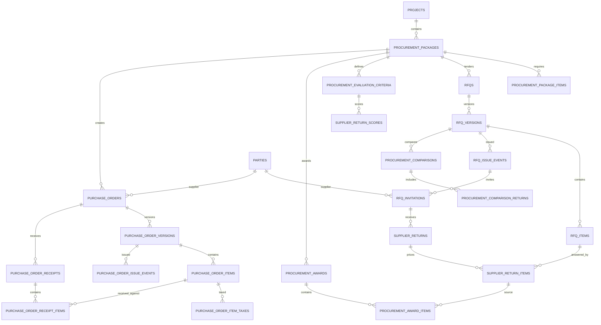

# 25 — Procurement Domain Model

## 1. Purpose

This specification defines NuBlox Schema Package 005: procurement, supplier enquiry, tender comparison, award, purchase ordering and receipt management.

The domain is designed to support contractors, consultants, facilities teams, trades and other built-environment organisations without creating a separate purchasing model for each profession.

The governing rule is:

> **Procurement records the commercial process and its evidence once; supplier identity remains in the shared Party model.**

A supplier, subcontractor, consultant, manufacturer or merchant therefore remains a `party` with one or more business roles rather than being copied into procurement-specific master tables.

## 2. Scope

Package 005 covers:

- procurement packages/work packages;
- package requirements and quantified items;
- RFQ/enquiry creation and immutable issued versions;
- supplier invitations and issue evidence;
- supplier returns and priced return items;
- tender/evaluation criteria and scoring;
- supplier comparison and award decisions;
- split awards where different items/quantities are awarded to different suppliers;
- purchase orders and immutable issued versions;
- purchase-order item tax snapshots;
- supplier/order issue snapshots;
- goods/service receipts and rejected quantities;
- derived procurement commitments for later commercial reporting.

Package 005 does **not** attempt to provide:

- a statutory accounts-payable ledger;
- supplier invoice matching/accounting posting;
- bank payments;
- inventory/warehouse stock control;
- a full subcontract administration suite;
- document binary storage (handled by the information/document package);
- project cost reporting/forecasting (handled by the commercial cost-control package).

## 3. Dependencies

Package 005 depends on the established models for:

- organisations and members;
- projects;
- parties and party roles;
- units of measure;
- tax categories;
- sales/commercial item types;
- audit/event principles;
- contract/finance conventions for immutable issued commercial records.

## 4. Normalisation target

The procurement transactional model targets **3NF by default**.

Key rules:

1. Supplier identity is not duplicated into a `suppliers` master table.
2. Package items, RFQ items, supplier-return items and PO items are separate facts at separate commercial stages.
3. Many-to-many and split-award relationships use junction/associative tables.
4. Issued RFQ and PO versions are immutable through normal application writes.
5. Mutable current supplier/contact data is not relied upon to reproduce an issued commercial document.
6. Totals are derived from versioned lines and tax snapshots unless a later ADR approves materialisation.
7. Procurement commitment is derived from authoritative issued PO/version facts rather than maintained as a second editable balance.
8. Tenant context is carried through composite candidate/foreign keys where it materially strengthens database-enforced isolation.

## 5. High-level lifecycle

```text
Project / Requirement
        ↓
Procurement Package
        ↓
Package Items
        ↓
RFQ / Enquiry
        ↓
RFQ Versions
        ↓
Issue / Supplier Invitations
        ↓
Supplier Returns
        ↓
Comparison / Evaluation
        ↓
Award
        ↓
Purchase Order
        ↓
PO Versions / Issue
        ↓
Goods or Service Receipt
        ↓
Commitment / Actual-cost inputs
```

The process may stop or branch at any stage. A sole trader may create a PO directly without an RFQ, while a large contractor may use the entire enquiry/comparison/award workflow.

## 6. ERD — procurement core



## 7. Procurement packages

`procurement_packages` represent the package or purchasing requirement, not the supplier order itself.

Examples:

- electrical installation package;
- structural steel package;
- windows package;
- lift maintenance service;
- architectural subconsultancy;
- heat-pump equipment supply;
- scaffolding package;
- facilities maintenance consumables.

A package belongs to one tenant and may optionally belong to a project.

Package status is workflow state, not financial state:

```text
draft → planned → enquiring → evaluating → awarded → ordered → complete
```

Cancellation remains explicit rather than being inferred from deletion.

## 8. Package items

`procurement_package_items` hold requirement facts such as:

- description;
- quantity;
- unit of measure;
- required-by date;
- optional target cost/rate;
- item type;
- sort/line order.

These items are planning facts. They are not overwritten by supplier quoted rates or PO rates.

## 9. RFQs and RFQ versions

`rfqs` are logical enquiry records.

`rfq_versions` contain the issueable commercial content.

Typical version state:

```text
draft → issued → superseded
             ↘ withdrawn
```

Once issued, an RFQ version is immutable through standard application writes. A correction produces another version.

`rfq_items` may reference package items, but remain independent snapshots of the requirement actually sent to suppliers.

## 10. RFQ issue and supplier invitations

Issue history is evidence and must not be reduced to a single `sent_at` column.

`rfq_issue_events` record each issue/reissue event.

`rfq_invitations` associate an issue event with the invited supplier party and optional contact party. They also snapshot recipient name/email used for the issue.

This allows NuBlox to answer:

- who was invited;
- which RFQ version they received;
- when it was issued;
- which contact/address was used;
- whether delivery was acknowledged/declined;
- which supplier return belongs to which invitation.

## 11. Supplier returns

A supplier may submit more than one return against the same invitation where revised submissions are allowed.

`suppler_returns` are logical submission headers with a controlled lifecycle:

```text
draft → submitted → superseded
                   ↘ withdrawn
```

`SUPPLIER_RETURNS` in the ERD corresponds to the SQL table `supplier_returns`.

`supplier_return_items` answer individual RFQ items and store the commercial facts actually submitted, including quantity, unit rate, lead time and qualifications.

Return totals are derived from returned lines and adjustments; they are not independent editable header balances.

## 12. Evaluation and comparison

Procurement evaluation needs both quantitative and qualitative evidence.

`procurement_evaluation_criteria` define package-level criteria such as:

- price;
- programme/lead time;
- quality;
- technical compliance;
- sustainability;
- competence;
- warranty;
- commercial terms.

Criteria may carry weighting percentages.

`procurement_comparisons` establish a comparison exercise for an RFQ version.

`procurement_comparison_returns` select the submitted returns being compared.

`supplier_return_scores` record criterion-specific scores and comments. The application may calculate a weighted score, but the underlying entered scores/weights remain separately normalised facts.

## 13. Awards and split awards

`procurement_awards` represent an approved commercial award decision.

A package can have more than one award where work is split.

`procurement_award_items` map specific quantities/items to the winning supplier-return item.

This avoids an unsafe assumption that one RFQ must always have one winner.

An award must record:

- approval status;
- awarded supplier;
- source supplier return;
- approved-by member;
- approval timestamp;
- award notes/conditions.

## 14. Purchase orders

`purchase_orders` are logical orders.

A purchase order points to:

- tenant;
- supplier party;
- project where applicable;
- procurement package where applicable;
- source award where applicable;
- responsible member;
- currency;
- order reference.

A purchase order may also be created directly without an RFQ/award where policy permits.

## 15. Purchase-order versions

`purchase_order_versions` separate the order identity from the commercial content issued to a supplier.

Typical state:

```text
draft → issued → superseded
             ↘ cancelled
```

Issued versions are immutable.

`purchase_order_items` store the ordered quantity/rate facts of that version.

Where a PO originates from an award, source links are preserved but the PO line remains an independent issue-time commercial fact.

## 16. PO tax snapshots

`purchase_order_item_taxes` snapshot the tax treatment/rate used when a PO version is issued.

The system must not later reproduce the historic PO using whichever tax rate happens to be current.

## 17. Supplier snapshots

Issued PO versions require supplier/contact/address snapshots so that historic orders remain reproducible when CRM details change.

The model therefore uses:

- `purchase_order_party_snapshots`;
- `purchase_order_party_snapshot_addresses`.

These are intentional historical facts and therefore do not violate the 3NF-first policy.

## 18. Issue events

`purchase_order_issue_events` record who issued the order, when, through which channel and which version was issued.

Reissues are new events; they do not overwrite the original evidence.

## 19. Receipts

`purchase_order_receipts` represent delivery/service-receipt events.

They support:

- goods receipt;
- service receipt;
- partial receipt;
- rejected/damaged quantity;
- delivery-note/reference capture;
- receiving member/date;
- receipt reversal/cancellation through explicit status.

`purchase_order_receipt_items` reference the exact PO item received against.

The database does not maintain an editable `quantity_remaining` field. Remaining quantity is derived from ordered quantity and valid receipt quantities.

## 20. Commitment model

NuBlox commercial reporting will later calculate procurement commitments from authoritative PO facts.

At a high level:

```text
Committed Cost
=
Issued Current PO Lines
+ approved PO adjustments/amendments
- cancelled/superseded commitments
```

Actual/received/accrued/invoiced cost is a separate concept and will be integrated with the commercial-cost-control and supplier-invoice/accounting integration layers.

No editable `committed_cost` balance is introduced in Package 005.

## 21. Supplier identity and validation

A `purchase_order.supplier_party_id` or `rfq_invitation.supplier_party_id` references the Party supertype.

Application policy must additionally verify that the party is appropriate for supplier procurement, normally by an active party role such as:

- supplier;
- subcontractor;
- consultant;
- manufacturer;
- merchant.

This is a business-policy validation rather than a duplicated supplier identity table.

## 22. Tenant integrity

All tenant-owned procurement roots carry `organisation_id`.

References to projects, parties, members, tax categories and other tenant-owned records use tenant-scoped candidate keys where practical.

The application must never fetch or mutate procurement data only by surrogate ID where organisation context is required.

## 23. Derived data

The following are derived rather than independently editable:

- RFQ totals;
- supplier-return totals;
- comparison weighted totals;
- PO net/tax/gross totals;
- PO committed value;
- quantity received;
- quantity remaining;
- package awarded/order coverage;
- supplier response rate.

Materialised summaries may later be introduced for reporting/performance only through a documented ADR.

## 24. State and immutability rules

Normal write APIs must enforce:

- issued RFQ versions are immutable;
- submitted/superseded supplier returns cannot be silently edited;
- approved awards require explicit reversal/supersession if changed;
- issued PO versions are immutable;
- receipt corrections use controlled reversal/cancellation rather than destructive edits where commercial history matters.

Each material transition must create an audit event.

## 25. Required application invariants

Some domain rules cannot be expressed completely using simple MySQL constraints and must also have application/integration tests:

1. RFQ item source package items must belong to the same procurement package/project context.
2. An RFQ invitation supplier must be a party in the same tenant.
3. A submitted return must answer an invitation for the same RFQ version.
4. A supplier-return item must reference an RFQ item from that return's RFQ version.
5. Evaluation weights must meet the configured policy, normally totalling 100% for weighted comparisons.
6. Scores must be within the configured scale.
7. Awarded items/quantities must not exceed configured award policy without explicit override authority.
8. Award supplier and source return must correspond.
9. A PO created from an award must use the awarded supplier unless authorised override is recorded.
10. PO source award items must be compatible with the referenced PO item.
11. An issued PO version must have supplier/address/tax snapshots required by policy.
12. Receipt quantity against a PO item must not exceed ordered quantity unless over-receipt policy explicitly permits it.
13. Receipt reversals must restore derived received/remaining quantities correctly.
14. All issue, submission, award and receipt transitions must be transactional and auditable.

## 26. Permissions

The capability catalogue should eventually distinguish permissions such as:

```text
procurement.package.view
procurement.package.create
procurement.package.manage
procurement.rfq.create
procurement.rfq.issue
procurement.return.record
procurement.return.evaluate
procurement.award.recommend
procurement.award.approve
procurement.po.create
procurement.po.approve
procurement.po.issue
procurement.receipt.record
procurement.receipt.reverse
```

Career titles may supply defaults, but actual permission is resolved by organisation/project policy and record state.

## 27. Future integration points

Later packages should connect procurement to:

- project cost codes and budgets;
- variations/change control;
- subcontract administration;
- supplier invoices and accounting integrations;
- document management/transmittals;
- delivery/site records;
- plant/material/asset creation;
- supplier performance reporting;
- competency/compliance records;
- notifications/approvals.

## 28. Acceptance criteria for Package 005

Package 005 is acceptable when:

- one supplier party can participate in many packages/RFQs without identity duplication;
- multiple suppliers can receive the same issued RFQ version;
- suppliers can submit comparable line-level returns;
- evaluation evidence is independently queryable;
- split awards are representable;
- purchase orders can originate from awards or direct purchasing;
- issued PO versions are historically reproducible;
- partial receipts/rejections are representable without overwriting ordered quantities;
- commitment and received balances can be derived from authoritative records;
- tenant boundaries are enforced consistently;
- all critical state changes are auditable;
- the schema remains 3NF-first and avoids editable duplicate totals.