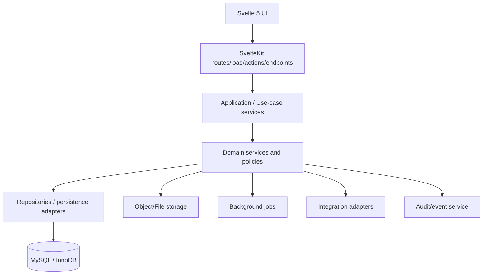

# 05 — System Architecture

## 1. Architectural style

Start as a **modular monolith** in one SvelteKit deployable application, with explicit internal domain boundaries.

Microservices are not the default. Extract a service only when there is an evidenced need such as independent scaling, security isolation, operational ownership or integration constraints.

## 2. Logical architecture



## 3. Svelte/SvelteKit conventions

Use Svelte 5 runes for new reactive code.

Recommended responsibilities:

- `+page.svelte` / components — presentation and interaction;
- `+page.server.ts` — request boundary, validation orchestration and application-service calls;
- `+server.ts` — API/webhook/file endpoints where appropriate;
- `$lib/server/**` — server-only domain/application/persistence code;
- `$lib/components/**` — reusable UI primitives and domain components;
- `$lib/types/**` — shared safe contracts/types.

Business rules must not live primarily in Svelte components.

## 4. Proposed code layout

```text
src/
├── lib/
│   ├── components/
│   │   ├── ui/
│   │   ├── data/
│   │   ├── forms/
│   │   └── domain/
│   ├── server/
│   │   ├── auth/
│   │   ├── db/
│   │   ├── audit/
│   │   ├── organisations/
│   │   ├── capabilities/
│   │   ├── crm/
│   │   ├── sales/
│   │   ├── contracts/
│   │   ├── finance/
│   │   ├── procurement/
│   │   ├── people/
│   │   ├── projects/
│   │   ├── documents/
│   │   ├── commercial/
│   │   ├── site/
│   │   ├── safety/
│   │   ├── quality/
│   │   ├── assets/
│   │   ├── maintenance/
│   │   ├── reporting/
│   │   └── integrations/
│   └── types/
└── routes/
    ├── (auth)/
    ├── (app)/
    ├── portal/
    └── api/
```

## 5. Request flow

```text
Browser
  → SvelteKit route/action
  → authentication
  → tenant context resolution
  → request validation
  → authorisation policy
  → application service
  → domain rules
  → transaction/repository
  → audit/outbox
  → response
```

No write path should trust an `organisation_id` supplied by the browser without checking membership and context.

## 6. Persistence

MySQL is the authoritative transactional data store.

Use InnoDB features:

- transactions;
- foreign keys where practical;
- row-level concurrency;
- appropriate unique constraints;
- indexed tenant/context keys.

Prefer relational columns for business-critical/queryable fields. Use JSON only for genuinely variable extension data, not as a substitute for schema design.

## 7. File storage

Recommended separation:

- MySQL stores document metadata, revision, classification, ownership, permissions, checksums and storage references.
- Object/file storage stores binary payloads.

Required controls:

- unique storage key;
- integrity hash/checksum;
- content type;
- size;
- malware-scan status;
- retention/legal hold metadata where required;
- no public bucket/object exposure by default.

## 8. Transactions and consistency

Operations that change multiple related business records must use database transactions when they form one business invariant.

Examples:

- accepting a quote and creating its originating job/project link;
- issuing an invoice and locking the issued snapshot;
- changing project membership and access grants;
- completing an inspection and creating linked defects.

External side effects should use an outbox/job pattern rather than holding database transactions open during network calls.

## 9. Background processing

A job mechanism will be required for:

- email;
- notifications;
- document conversion/previews;
- malware scans;
- scheduled reminders;
- recurring maintenance generation;
- report generation;
- integration sync;
- AI processing.

Jobs must be idempotent and observable.

## 10. Search

Initial search may use indexed MySQL queries for structured records.

Introduce a dedicated search service only when requirements justify:

- cross-entity full-text search;
- document text indexing;
- fuzzy matching;
- large-scale faceting.

## 11. Integration boundary

All third-party services must be behind adapters/interfaces so vendors can change without rewriting domain logic.

Likely adapter categories:

- email;
- calendar;
- accounting;
- payments;
- e-sign;
- file/object storage;
- maps/geocoding;
- identity/SSO;
- messaging;
- BIM/CDE;
- AI/model provider.

## 12. Observability

Every request/job should support correlation identifiers.

Collect:

- structured application logs;
- security logs;
- audit events;
- metrics;
- traces where useful;
- error reporting.

Sensitive fields must be excluded/redacted.

## 13. Future extraction criteria

A module may become an independent service if at least one is true:

- materially different scaling profile;
- strict security/data boundary;
- independently deployed integration workload;
- dedicated team ownership;
- high-volume asynchronous processing;
- separate availability requirements.

Do not split simply because the domain has a different folder.
