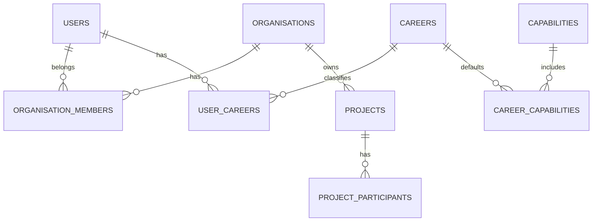

# 06 — Data Model

## 1. Data modelling principles

- Relational-first.
- Every tenant-owned root record is explicitly owned by an organisation.
- Project-sharing does not erase tenant ownership.
- Historical attribution survives user/member deactivation.
- Financial values use `DECIMAL`, never binary floating point.
- Times are stored in UTC with user/organisation timezone used for display.
- Business status is explicit, not inferred from deletion.
- Material records are archived/voided/superseded rather than physically deleted where history matters.

## 2. Core identity/tenant model



## 3. Core tables

### Identity and tenancy

- `users`
- `user_emails`
- `sessions`
- `organisations`
- `organisation_members`
- `teams`
- `team_members`
- `organisation_locations`

### Career/capability

- `professional_domains`
- `careers`
- `career_aliases`
- `capabilities`
- `career_capabilities`
- `user_careers`
- `permission_roles`
- `role_permissions`
- `member_roles`

### CRM

- `parties` or separate `contacts`/`companies` after discovery
- `party_addresses`
- `party_relationships`
- `opportunities`
- `activities`

### Sales/contracts/finance

- `quotes`
- `quote_versions`
- `quote_items`
- `contracts`
- `contract_key_dates`
- `invoices`
- `invoice_items`
- `payments`
- `expenses`

### Procurement

- `suppliers`
- `rfqs`
- `rfq_recipients`
- `supplier_returns`
- `purchase_orders`
- `purchase_order_items`
- `receipts`

### Workforce

- `workers`
- `worker_competencies`
- `competency_types`
- `timesheets`
- `timesheet_entries`

### Projects

- `projects`
- `project_sites`
- `project_participants`
- `project_roles`
- `project_stages`
- `tasks`
- `milestones`

### Built environment hierarchy

- `buildings`
- `levels`
- `spaces`
- `systems`
- `assets`
- `asset_components`

The hierarchy must be optional for small jobs.

### Documents/information

- `documents`
- `document_versions`
- `document_links`
- `transmittals`
- `rfis`
- `rfi_responses`
- `instructions`
- `submittals`
- `change_events`
- `variations`

### Site/quality/safety

- `site_diaries`
- `site_diary_entries`
- `photos`
- `deliveries`
- `plant_usage`
- `inspection_templates`
- `inspections`
- `inspection_items`
- `issues`
- `defects`
- `ncrs`
- `safety_records`
- `incidents`
- `briefings`

### Asset/FM

- `maintenance_plans`
- `work_orders`
- `service_records`
- `warranties`
- `commissioning_records`

### Platform

- `audit_events`
- `notifications`
- `outbox_events`
- `background_jobs` or provider-backed equivalent
- `integration_connections`
- `webhook_deliveries`

## 4. Tenant-key pattern

Most tenant tables require:

```sql
organisation_id BIGINT UNSIGNED NOT NULL
```

and common indexes should begin with tenant/context when queries are tenant-scoped:

```sql
INDEX idx_projects_org_status (organisation_id, status)
```

A unique business reference usually needs tenant scope:

```sql
UNIQUE KEY uq_project_reference (organisation_id, reference)
```

## 5. Public and internal identifiers

Final ID strategy is an open architecture decision.

Requirements:

- public URLs must use opaque, non-guessable identifiers where enumeration would be sensitive;
- internal keys must index efficiently in MySQL;
- integrations require stable identifiers;
- IDs must not change during data migration.

A valid approach is an internal `BIGINT UNSIGNED` primary key plus a unique public UUID/ULID-style identifier. A UUIDv7-style binary key is another option if the selected MySQL access layer handles it cleanly.

## 6. Money

Use fixed precision, e.g.:

```sql
DECIMAL(19,4)
```

for stored monetary amounts/rates unless finance discovery establishes another standard.

Store:

- transaction currency;
- net;
- tax;
- gross;
- rounding basis where relevant.

Never derive historic issued-document totals from mutable product/rate tables.

## 7. Time and dates

Use:

- UTC timestamp/datetime for events;
- local date where the business concept is a date rather than an instant;
- timezone identifier at user/organisation/project level where necessary.

Do not store only formatted local strings.

## 8. Soft deletion and archival

Do not apply generic soft-delete indiscriminately.

Recommended:

- master/reference data: deactivate/archive;
- draft records: delete may be permitted with audit;
- issued/approved/contractual records: void/supersede/cancel with history;
- security/audit records: retention-controlled and not normal user-deletable.

## 9. Document model

```text
documents
  id
  organisation_id
  project_id?
  document_number?
  title
  classification
  current_version_id
  status

document_versions
  id
  document_id
  revision
  status
  storage_key
  checksum
  content_type
  size_bytes
  uploaded_by_user_id
  created_at
```

Never overwrite the payload of an existing document version.

## 10. Generic linking

Cross-domain records often need links.

Use a controlled relation/link table only where beneficial, e.g. linking a document to an asset, RFI or variation. Avoid making the entire business schema an entity-attribute-value model.

## 11. Audit model

Suggested fields:

```text
id
occurred_at
organisation_id
actor_user_id
actor_member_id
action
entity_type
entity_id
project_id
correlation_id
ip/context metadata (appropriately protected)
change_summary JSON
```

Audit data must not become a second uncontrolled store of sensitive full-record snapshots.

## 12. Referential integrity

Use foreign keys for strong ownership/referential rules where operationally practical.

Also enforce invariants in domain/application services, for example:

- project participant organisation must be valid;
- invoice project must belong/be visible to invoice organisation;
- document version cannot belong to a different tenant from document;
- a user cannot grant permissions they do not have authority to grant.

## 13. Migration requirements

- schema migrations are version controlled;
- production migrations are repeatable and reviewed;
- destructive changes require migration/backfill plans;
- large backfills must not require long blocking transactions;
- every release records schema version.
