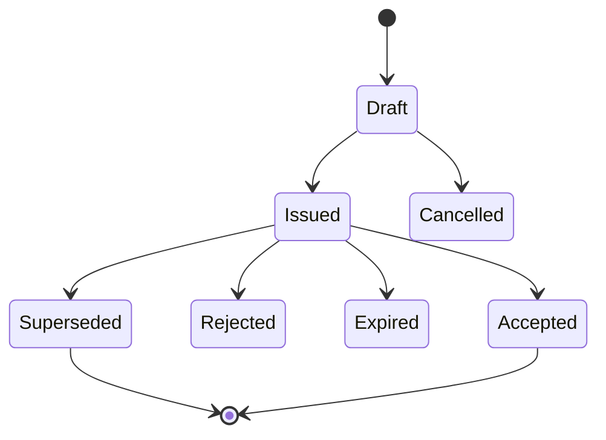
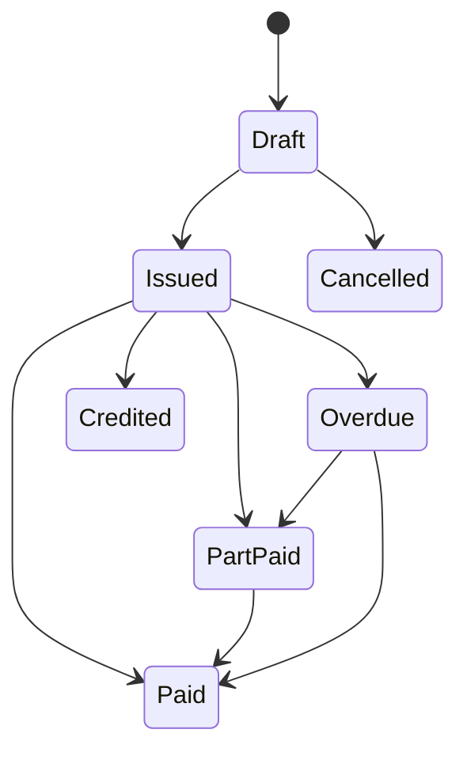

# 20 — Record Lifecycles and State Machines

State transitions must be validated server-side and audited for material records.

## Quote



Rules:

- issued version is preserved;
- acceptance references a specific version;
- revision after issue creates a new/superseding version.

## Invoice



Issued invoice snapshots cannot be silently edited.

## Project/job

```text
Prospect/Proposed → Active → On Hold → Completed → Archived
                         ↘ Cancelled
```

Business-specific project stages are separate from lifecycle status.

## Document

```text
Draft → Shared/Issued → Reviewed/Approved (where applicable)
             ↓
         Superseded
```

Document record and document version are distinct.

## RFI

```text
Draft → Open → Responded → Closed
          ↘ Cancelled
```

Reopen must be explicit and audited.

## Variation/change

```text
Identified → Priced → Submitted → Approved
                         ↘ Rejected
                         ↘ Withdrawn
```

Optional states such as instructed/implemented/certified can be configured by contract workflow, but the baseline must preserve commercial history.

## Inspection

```text
Draft → In Progress → Completed → Reviewed/Accepted
                               ↘ Requires Action
```

Completed inspection answers/evidence must not be overwritten; amendments require controlled revision/addendum.

## Defect/issue

```text
Open → Assigned → In Progress → Ready for Review → Closed
                                      ↘ Rejected/Reopened
```

## Work order

```text
Requested → Approved → Scheduled → In Progress → Completed → Closed
                  ↘ Cancelled
```

Emergency/reactive workflows may shorten approval but must retain attribution.

## Purchase order

```text
Draft → Approved → Issued → Part Fulfilled → Fulfilled → Closed
          ↘ Rejected                    ↘ Cancelled
```

## Contract/appointment

```text
Draft → Under Review → Executed → Active → Complete/Expired
                            ↘ Terminated
```

## State-machine implementation requirement

Each state transition should define:

- allowed source states;
- required permission;
- required fields/evidence;
- side effects;
- notification behaviour;
- audit event;
- whether transition is reversible;
- idempotency behaviour.
