# NuBlox Complete Application Guide (Step by Step)

This guide covers each major application area with direct steps, figure references, and label maps.

## 1. Sign in and select organisation

1. Open the sign-in page.
2. Enter Email and Password.
3. Select Sign in.
4. Select your organisation from the context chooser.

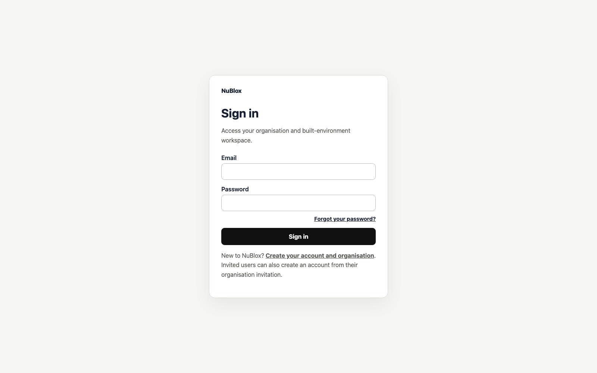

Labels:
1. Product identifier
2. Sign-in heading
3. Credential fields
4. Sign-in action

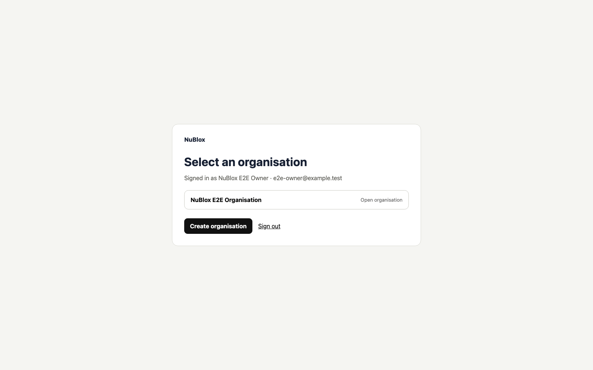

Labels:
1. Organisation selection heading
2. Signed-in identity
3. Organisation card
4. Open organisation action

## 2. Dashboard, search, and create

1. Confirm you land on Dashboard.
2. Use Search to find a workspace quickly.
3. Use Create to start controlled record flows.

Labels:
1. Primary navigation
2. Workspace tools
3. Context header
4. Main workspace content

## 3. Core workspace entry points

1. Open Projects.
2. Open Documents.
3. Open Finance.
4. Open More for specialist areas.

Labels:
1. Workspace heading
2. Workspace navigation
3. Main list/panel
4. Create/open controls

## 4. Enterprise search and portal management

1. Open Enterprise search from More.
2. Enter a term and run search.
3. Open Portal Manage Sharing.
4. Select a project and assign controlled external work.

Labels:
1. Search/portal heading
2. Input or project selector
3. Results or participant panel
4. Controlled action cards/buttons

## 5. My Work

1. Open My work from navigation.
2. Review your assigned and due work.
3. Open an item to action it in context.

Labels:
1. My Work heading
2. Work lists
3. Filter/context controls
4. Work item actions

## 6. Projects

1. Open Projects.
2. Use list/search to locate a project.
3. Open a project record for detail and controls.

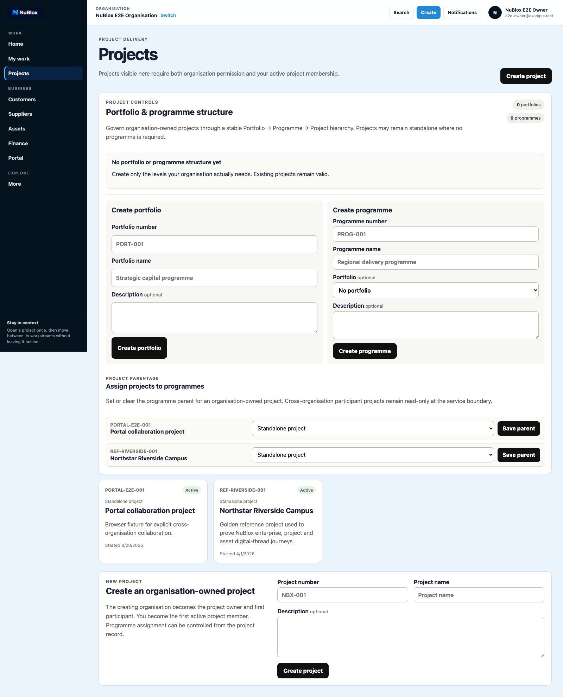

Labels:
1. Projects heading
2. Project register
3. Search/filter controls
4. Project actions

## 7. CRM: Customers and Contacts

1. Open Customers.
2. Create or open an organisation/person record.
3. Update canonical profile details.

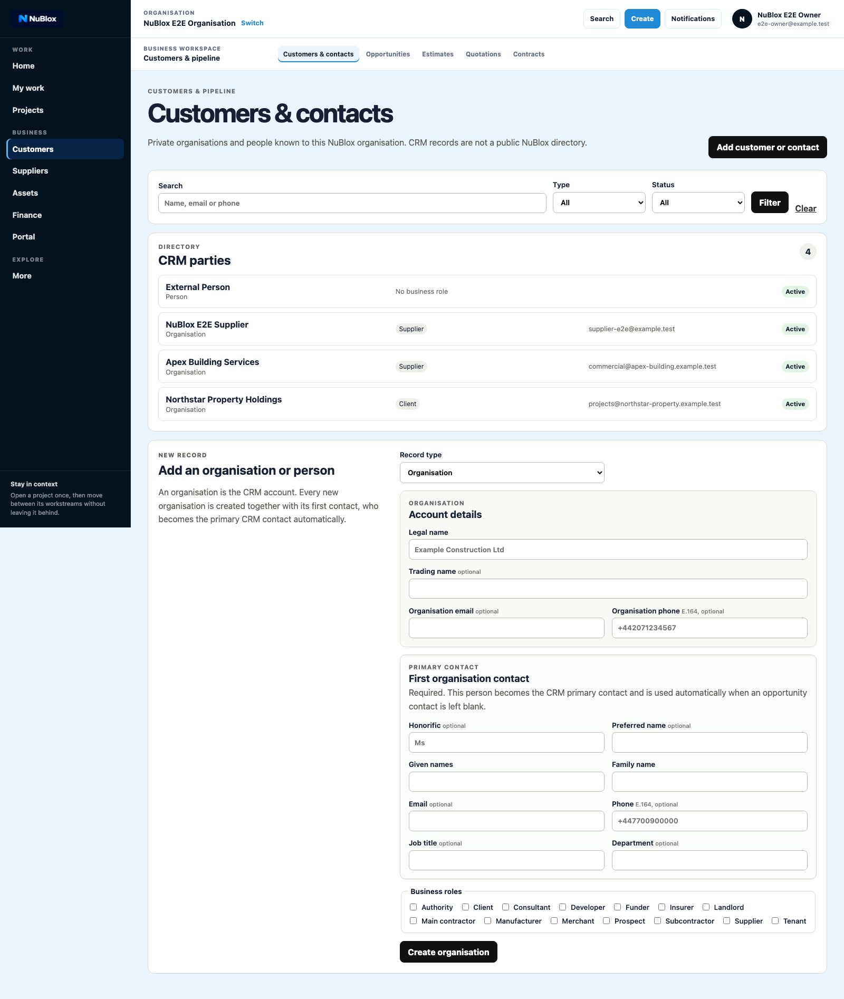

Labels:
1. Customers heading
2. Party register
3. Create organisation/contact
4. Filter/search controls

## 8. CRM: Opportunities

1. Open Opportunities.
2. Create a new opportunity.
3. Set stage, value, and owner.
4. Save and review pipeline status.

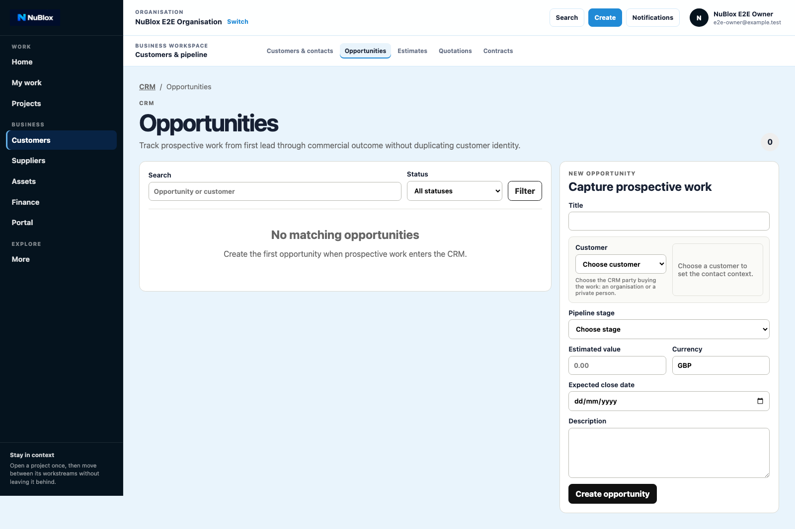

Labels:
1. Opportunities heading
2. Opportunity list
3. New opportunity action
4. Stage/value fields

## 9. Commercial: Estimates

1. Open Estimates.
2. Create a new estimate.
3. Add scope/cost lines and assumptions.
4. Save and review totals.

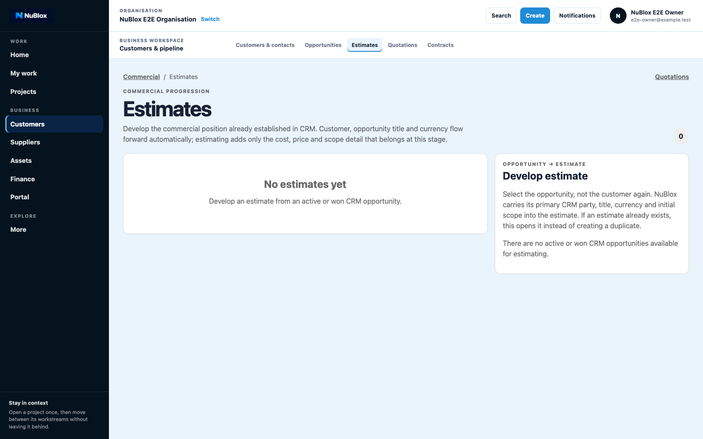

Labels:
1. Estimates heading
2. Estimate register
3. New estimate action
4. Commercial detail panel

## 10. Commercial: Quotations

1. Open Quotations.
2. Create or convert from estimate.
3. Issue quotation and track status.

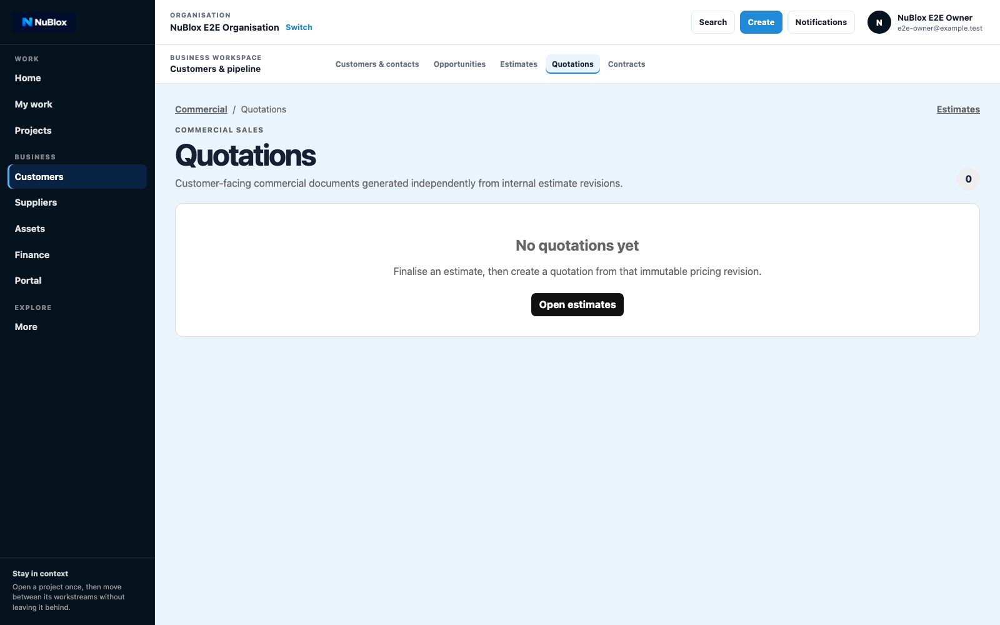

Labels:
1. Quotations heading
2. Quotation list
3. Issue/convert actions
4. Status controls

## 11. Purchasing

1. Open Purchasing.
2. Create package/requirement.
3. Progress to orders and commitments.

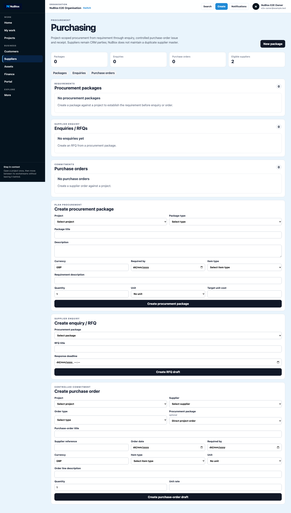

Labels:
1. Purchasing heading
2. Package/order registers
3. Create controls
4. Lifecycle/status fields

## 12. Contracts

1. Open Contracts.
2. Create or open a contract.
3. Maintain controlled contract changes.

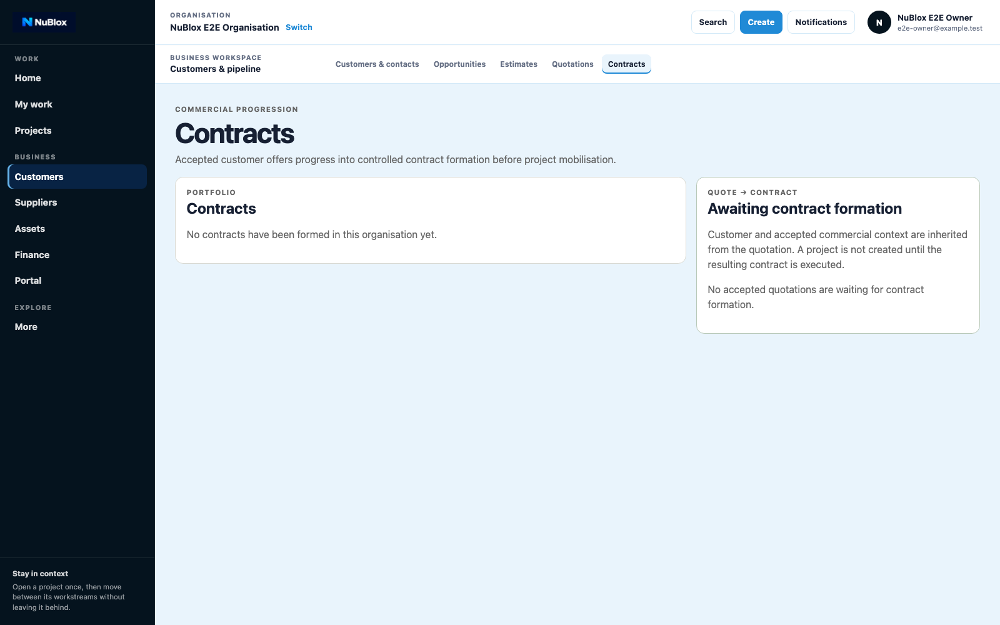

Labels:
1. Contracts heading
2. Contract register
3. Contract actions
4. Amendment/status panel

## 13. Project Cost Control

1. Open Project cost control.
2. Select a project scope.
3. Review cost code, commitment, and forecast views.

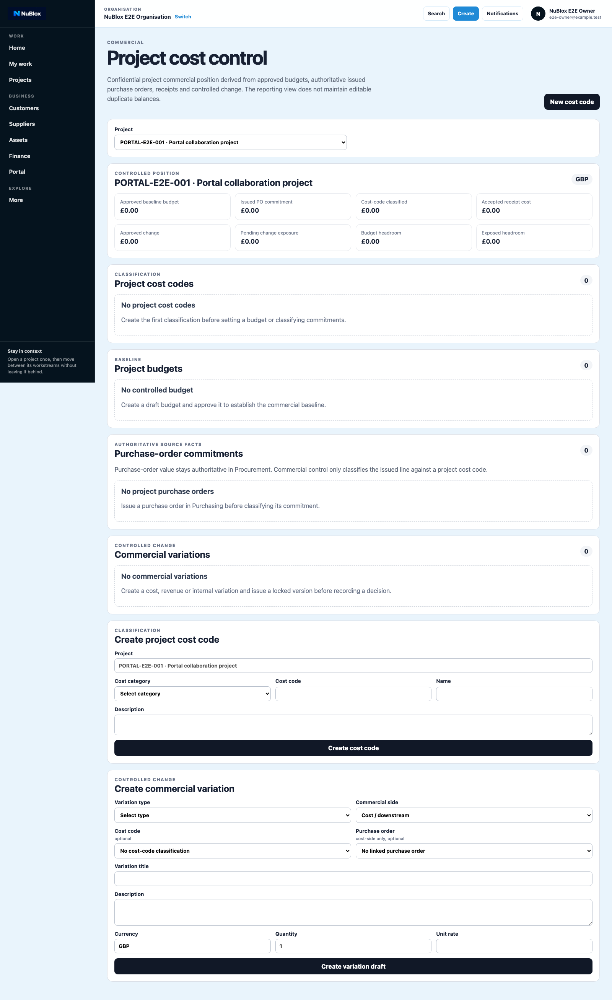

Labels:
1. Cost control heading
2. Project selector
3. Cost control grid
4. Control actions

## 14. Valuations

1. Open Valuations.
2. Create a valuation period record.
3. Review certified and pending values.

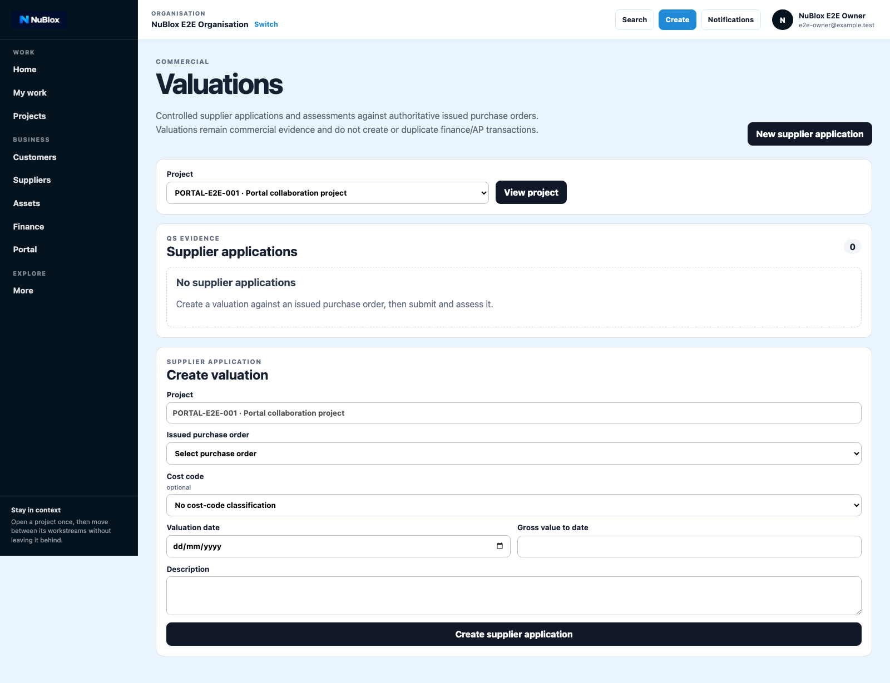

Labels:
1. Valuations heading
2. Valuation register
3. Create/review actions
4. Amount and status fields

## 15. People

1. Open People.
2. Create/open workforce member.
3. Maintain employment/engagement attributes.

Labels:
1. People heading
2. Worker register
3. Member actions
4. Engagement fields

## 16. Schedule

1. Open Schedule.
2. Create/open schedule entries.
3. Review sequencing and assignments.

Labels:
1. Schedule heading
2. Schedule board/list
3. Work allocation controls
4. Timeline fields

## 17. Time

1. Open Time.
2. Create/open timesheet entries.
3. Submit/approve work sessions.

Labels:
1. Time heading
2. Timesheet grid/list
3. Entry controls
4. Submit/approve actions

## 18. Site, Quality and Safety

1. Open Site, quality and safety.
2. Create/open diaries, inspections, observations.
3. Record closure/evidence updates.

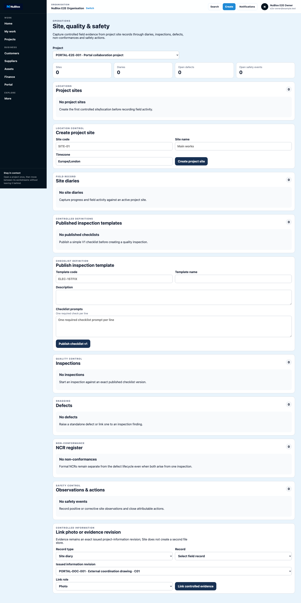

Labels:
1. Workspace heading
2. Site/quality/safety tabs
3. Register area
4. Controlled action buttons

## 19. Assets and Facilities

1. Open Assets.
2. Create facility/building/asset records.
3. Manage maintenance workflows.

Labels:
1. Assets heading
2. Asset register
3. Create asset/facility actions
4. Maintenance controls

## 20. Finance: Invoices

1. Open Finance Invoices.
2. Create/open invoice records.
3. Issue and track invoice lifecycle.

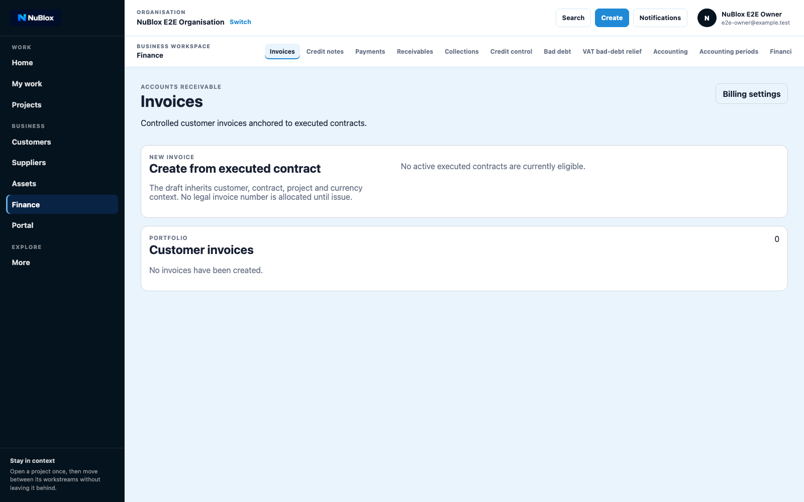

Labels:
1. Invoices heading
2. Invoice register
3. Create/issue actions
4. Status and value fields

## 21. Finance: Payments

1. Open Finance Payments.
2. Record payment receipt or disbursement.
3. Allocate to outstanding items.

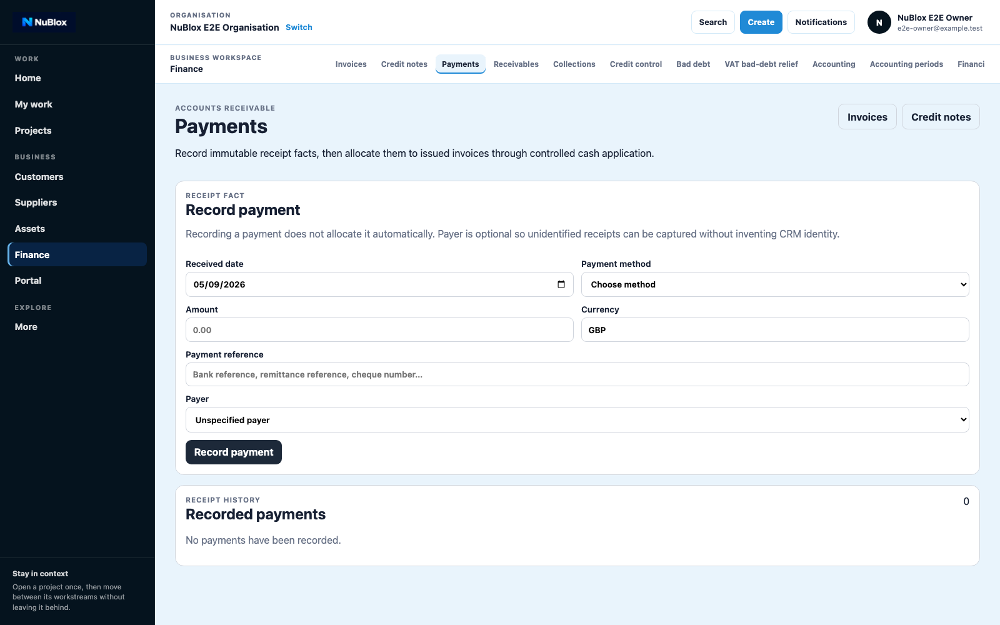

Labels:
1. Payments heading
2. Payment register
3. Allocation controls
4. Posting/status fields

## 22. Finance: Receivables

1. Open Receivables.
2. Review outstanding balances.
3. Drill into account-level detail.

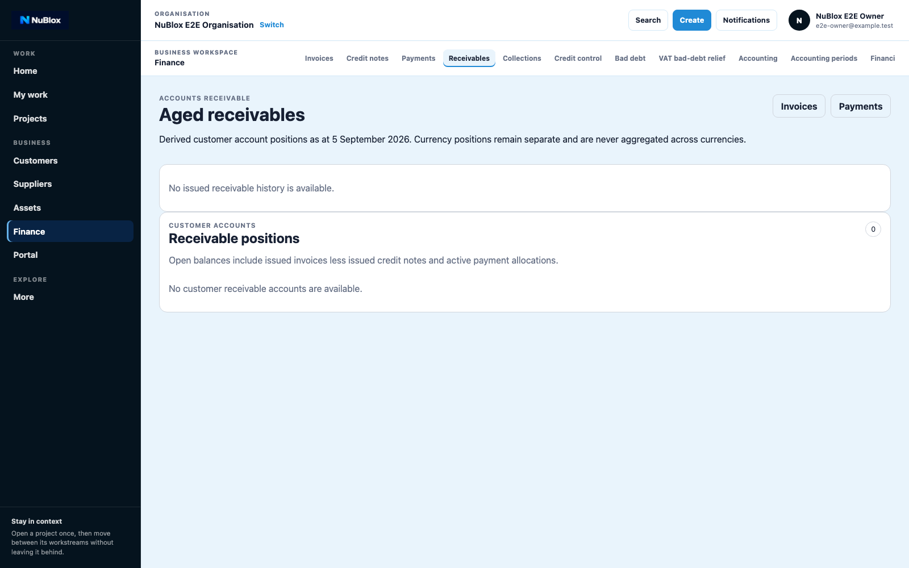

Labels:
1. Receivables heading
2. Balance view/list
3. Filter controls
4. Account actions

## 23. Finance: Collections

1. Open Collections.
2. Review collection queues and activities.
3. Execute approved collection actions.

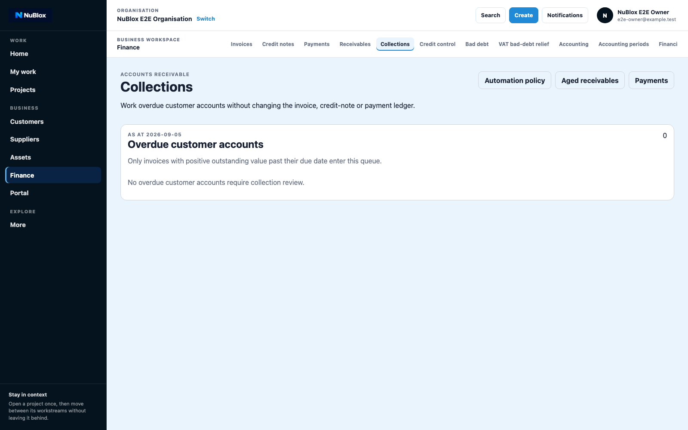

Labels:
1. Collections heading
2. Queue/list panel
3. Collection activity controls
4. Outcome/status fields

## 24. Finance: Collections Automation

1. Open Collections automation.
2. Configure rule/policy controls.
3. Review generated actions and status.

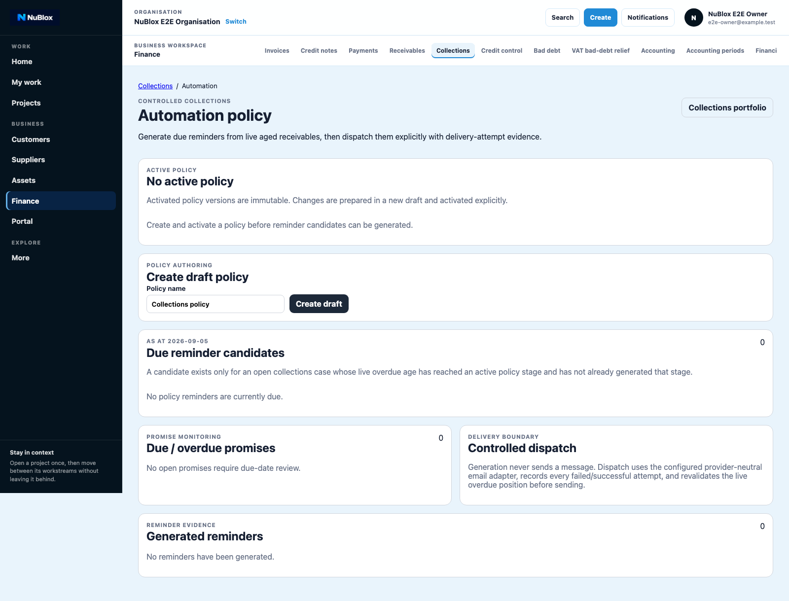

Labels:
1. Automation heading
2. Policy/rule controls
3. Generated action list
4. Enable/disable controls

## 25. Finance: Credit Control

1. Open Credit control.
2. Review limits, holds, and breaches.
3. Apply approved limit/hold decisions.

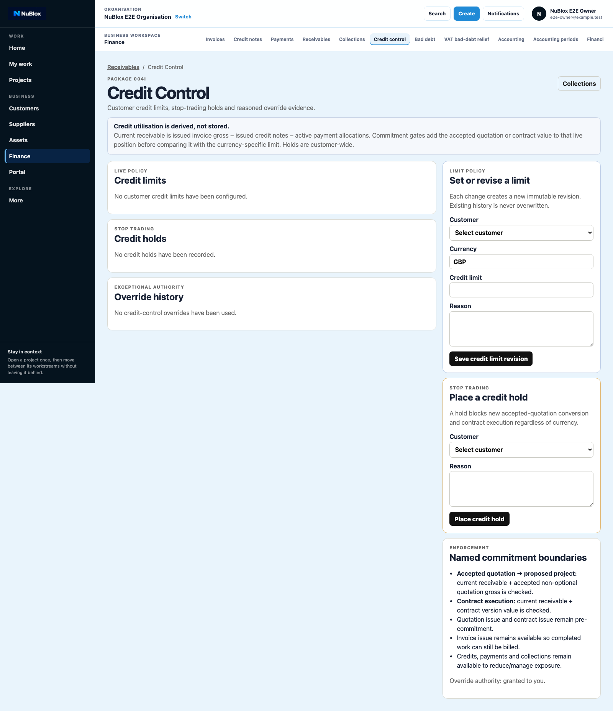

Labels:
1. Credit control heading
2. Customer credit panel
3. Hold/limit controls
4. Risk/status indicators

## 26. Finance: Bad Debt

1. Open Bad debt.
2. Create/write off candidate records.
3. Track recoveries and adjustments.

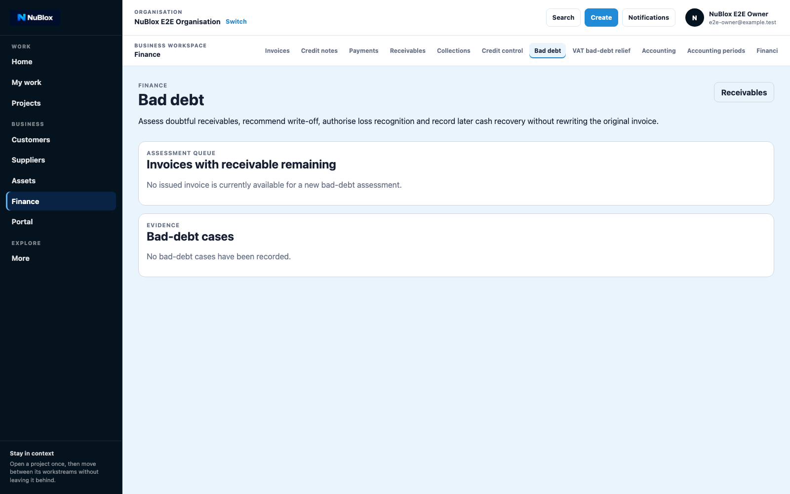

Labels:
1. Bad debt heading
2. Write-off/recovery register
3. Action controls
4. Accounting status

## 27. Finance: Tax

1. Open Tax.
2. Review tax category and posting records.
3. Validate tax treatment on relevant documents.

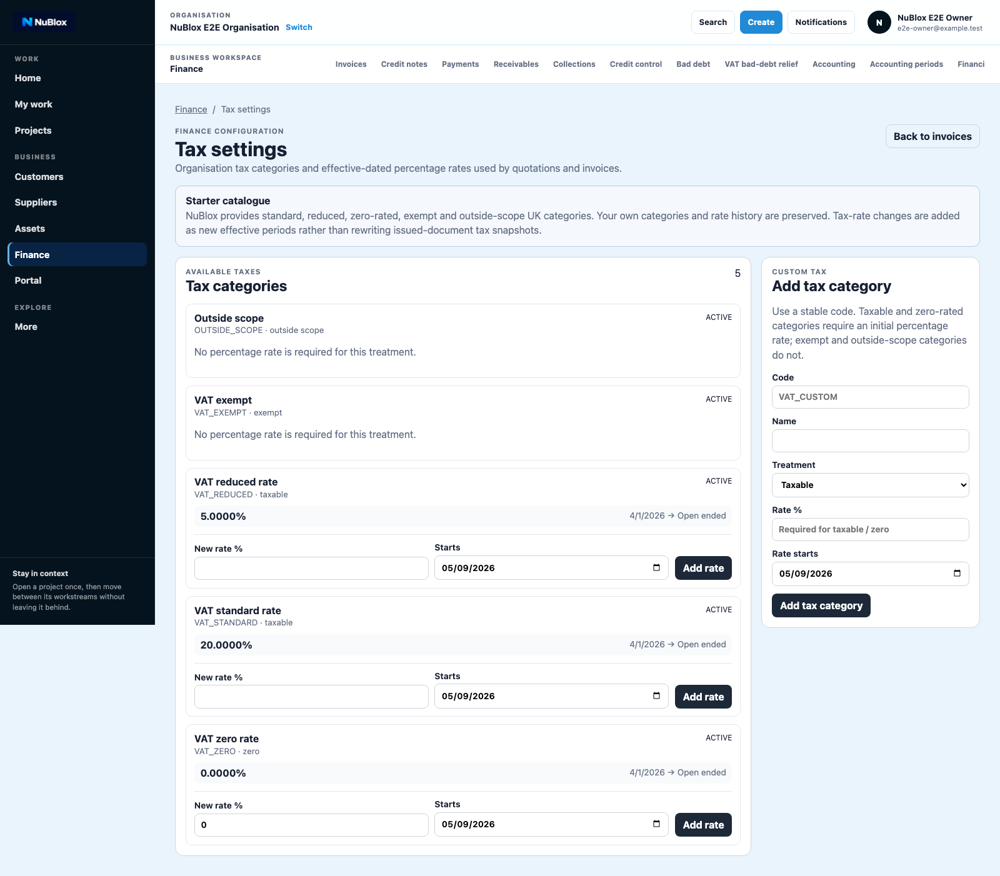

Labels:
1. Tax heading
2. Tax record list
3. Category/period controls
4. Calculation/output panel

## 28. Finance: Tax Relief

1. Open Tax relief.
2. Review relief eligibility records.
3. Submit or approve relief claims.

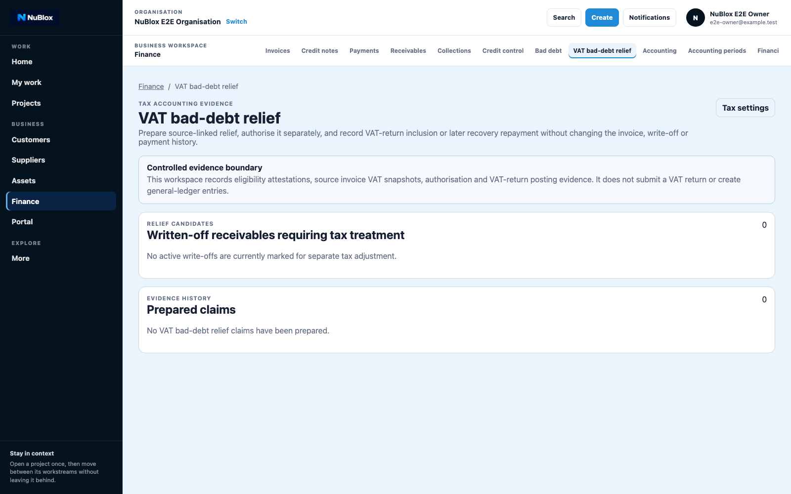

Labels:
1. Tax relief heading
2. Relief register
3. Claim controls
4. Status/results fields

## 29. Finance: Billing

1. Open Billing.
2. Prepare billing records.
3. Progress through billing controls and issuance.

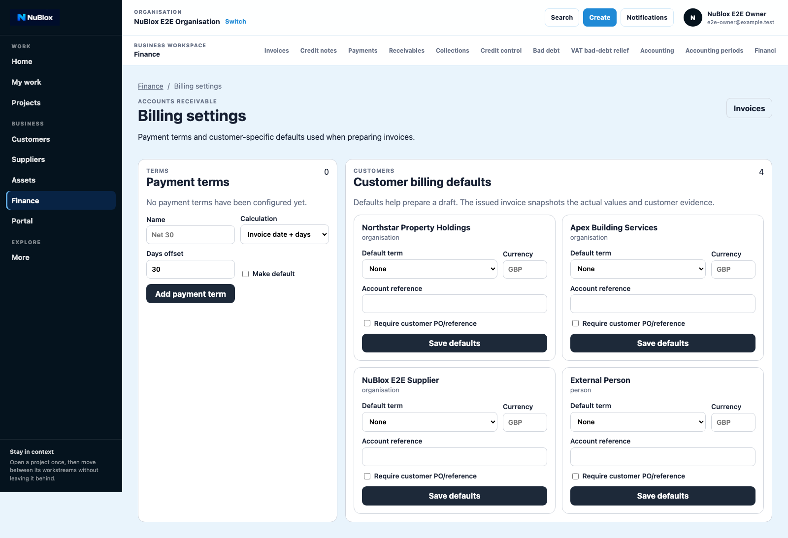

Labels:
1. Billing heading
2. Billing register
3. Creation/issue controls
4. Value/status panels

## 30. Finance: Accounting

1. Open Accounting.
2. Review journals, postings, and period state.
3. Open required accounting sub-workspace.

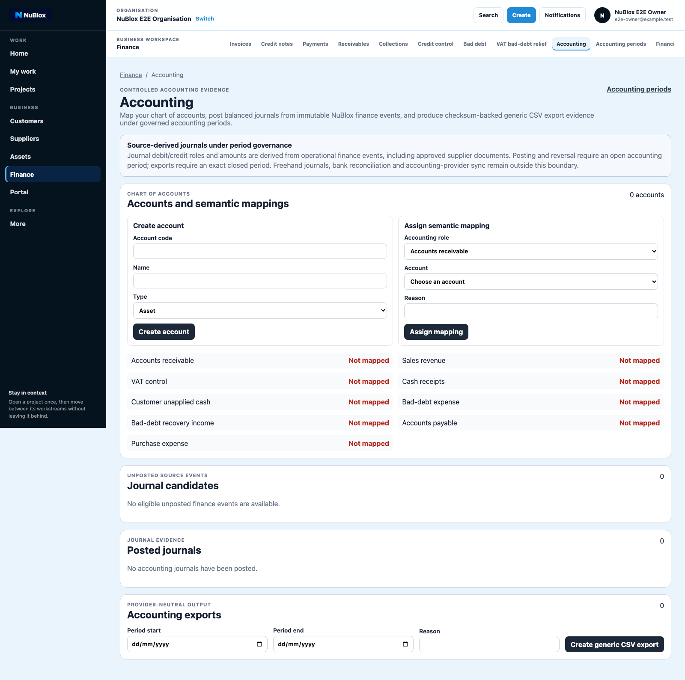

Labels:
1. Accounting heading
2. Accounting navigation
3. Posting/report panel
4. Control actions

## 31. Finance: Accounting Periods

1. Open Accounting periods.
2. Create a financial year/period.
3. Progress period lifecycle (open/close controls).

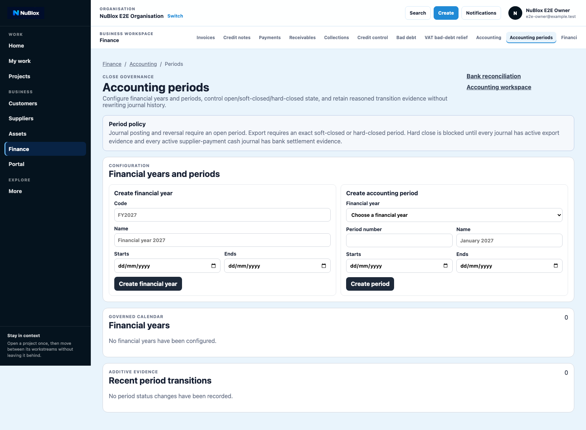

Labels:
1. Periods heading
2. Year/period table
3. Lifecycle controls
4. Governance actions

## 32. Finance: Accounting Reports

1. Open Accounting reports.
2. Choose report period/context.
3. Run and review generated report output.

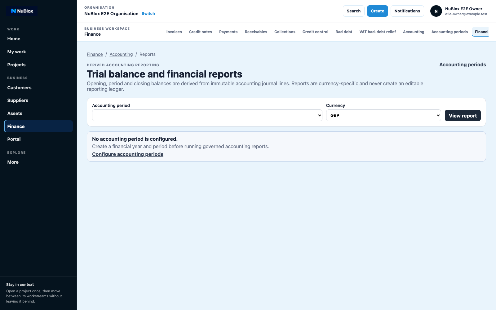

Labels:
1. Reports heading
2. Report selector
3. Run/export actions
4. Report result panel

## 33. Finance: Year-End

1. Open Year-end close.
2. Run close-readiness checks.
3. Progress year-end closure workflow.

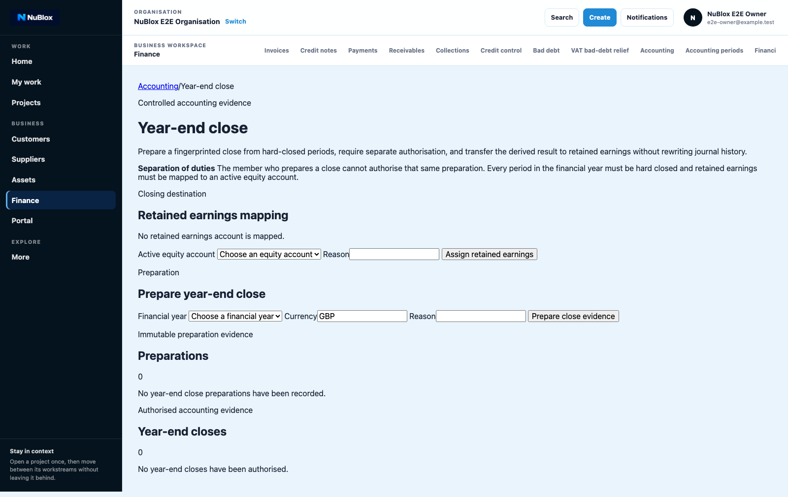

Labels:
1. Year-end heading
2. Readiness checklist
3. Close actions
4. Completion status

## 34. Organisation settings

1. Open Organisation.
2. Maintain profile, legal identifiers, roles, and invitations.
3. Review explicit permission exceptions when required.

Labels:
1. Organisation heading
2. Governance/admin navigation
3. Profile and role controls
4. Invite/member controls

## 35. Contexts

1. Open Contexts.
2. Review recent and favourite contexts.
3. Pin/open context to keep it active while navigating workspaces.

Labels:
1. Contexts heading
2. Recent/favourites lists
3. Open/pin controls
4. Active context indicator

## 36. Capability registry

1. Open Capability registry.
2. Search or filter capability domains.
3. Open capability links to governed route areas.

Labels:
1. Registry heading
2. Domain list
3. Filter/search controls
4. Workspace route links

## 37. Enterprise search (empty/start state)

1. Open Enterprise search.
2. Enter a search term.
3. Run search and review authorised-only results.

Labels:
1. Search heading
2. Query field
3. Search action
4. Result state panel

## 38. Portal shared work

1. Open Portal shared work.
2. Review items explicitly shared by internal project teams.
3. Action tasks from the portal card workflow.

Labels:
1. Shared work heading
2. Work card list
3. Action buttons
4. Project/source context details

## Usage notes

- Permissions determine visibility of workspaces and actions.
- Keep project context pinned where available when switching business functions.
- Controlled records should be progressed through their lifecycle states, not overwritten informally.
