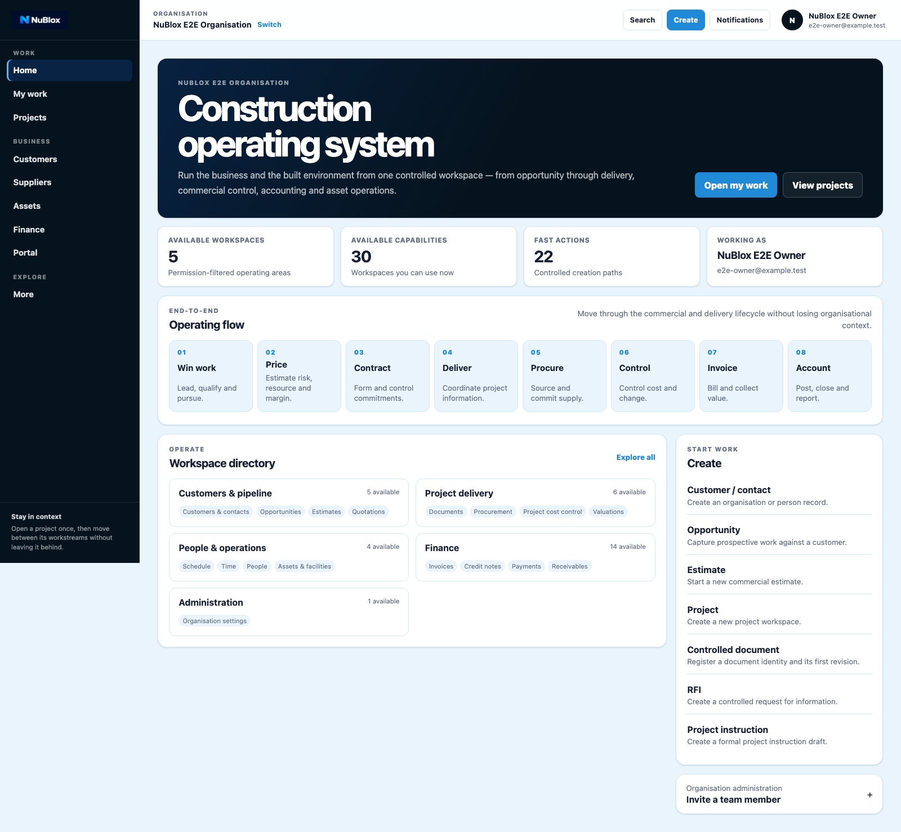
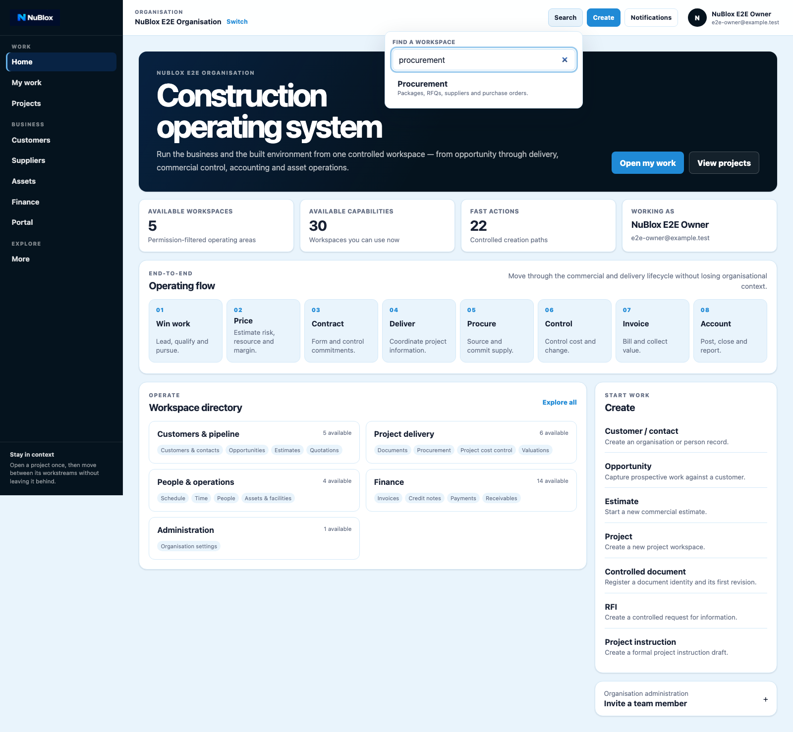
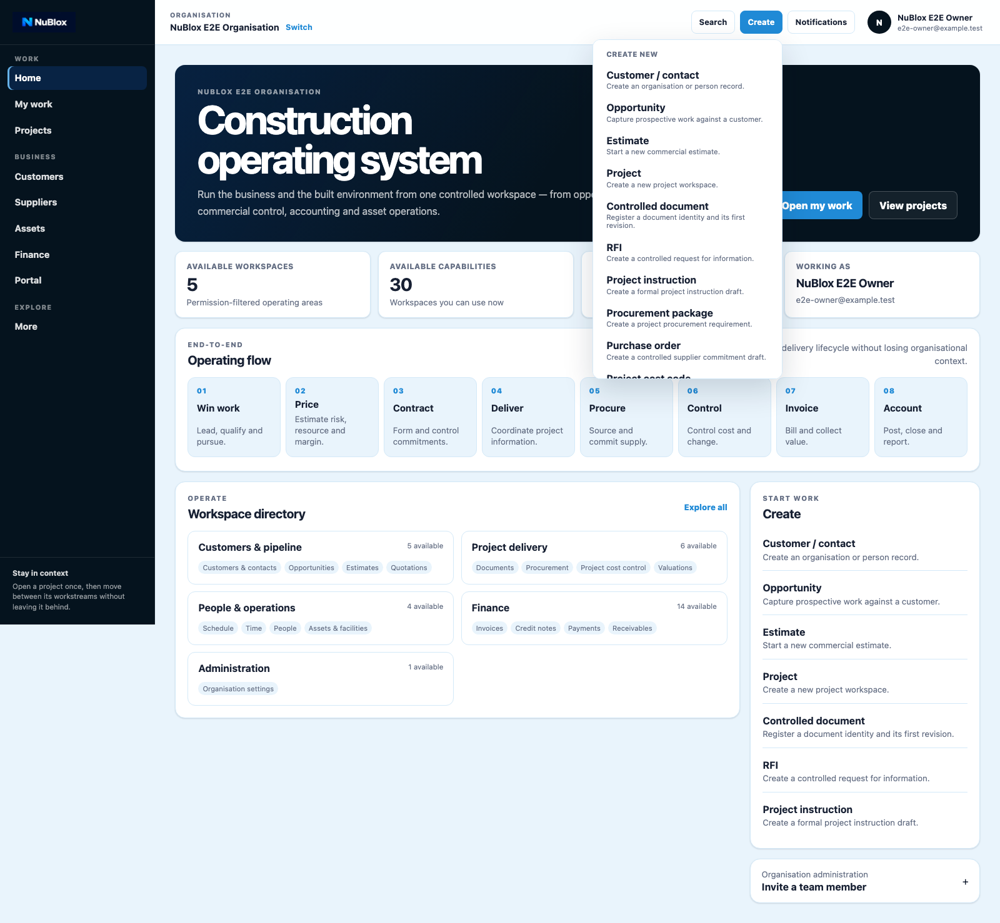

# Guide 02: Navigation, Search, and Create

## Purpose

Use this guide to move through NuBlox efficiently using primary navigation, workspace search, and controlled create actions.

## Preconditions

- You are signed in and have selected an organisation context.
- You are on the dashboard or another app workspace.

## Procedure A: Understand the dashboard shell

1. Confirm the primary navigation is visible on the left.
2. Confirm workspace tools are visible in the top bar.
3. Use Home, My work, Projects, and business area links to change workspace.

## Figure 3: Dashboard home

### Figure 3 labels

1. Primary navigation (`Home`, `My work`, `Projects`, etc.)
2. Organisation context and switch link
3. Workspace tools (`Search`, `Create`, `Notifications`)
4. Main dashboard heading and operating summary
5. Workspace directory cards
6. Quick create section inside dashboard body

## Procedure B: Use workspace search

1. Select **Search** in workspace tools.
2. Enter a keyword in **Find a workspace**.
3. Choose a matching workspace result.

## Figure 4: Workspace search

### Figure 4 labels

1. Search tool trigger
2. Query input (`Find a workspace`)
3. Search result list
4. Matching workspace links

## Procedure C: Use controlled create actions

1. Select **Create** in workspace tools.
2. Pick the appropriate record/action type.
3. Complete required fields in the destination workspace form.

## Figure 5: Create menu

### Figure 5 labels

1. Create tool trigger
2. Create menu heading
3. Customer/commercial creation links
4. Project and document creation links
5. Delivery and operations creation links
6. Finance creation links

## Success criteria

- You can discover a workspace through search.
- You can start a controlled creation path from the global create menu.
