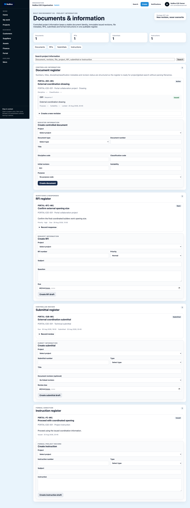
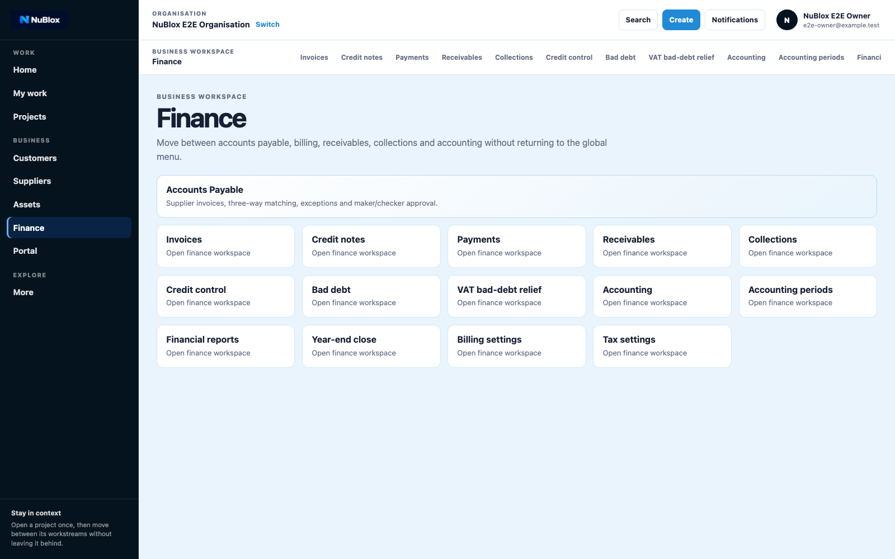
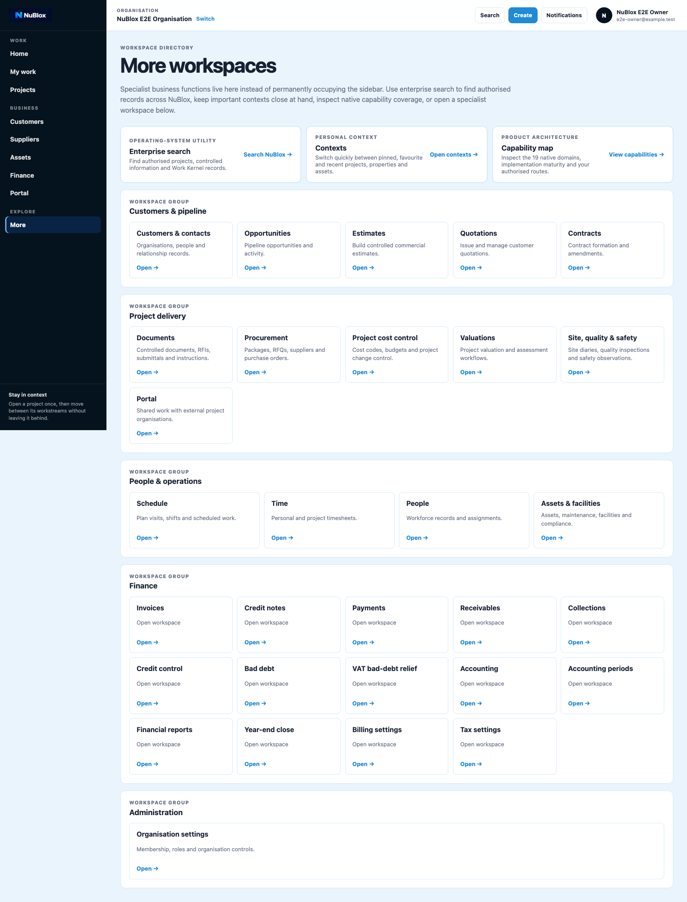

# Guide 03: Core Workspaces (Projects, Documents, Finance)

## Purpose

Use this guide to navigate the three core workspaces most teams use daily: Projects, Documents, and Finance.

## Preconditions

- You are signed in and working inside an organisation context.
- Your role has view access to these workspaces.

## Procedure A: Open Projects workspace

1. Select **Projects** in primary navigation.
2. Review project list, filters, and entry points.
3. Open a project to continue into project-specific controls.

## Figure 6: Projects workspace

### Figure 6 labels

1. Workspace heading
2. Project listing region
3. Create/open actions
4. Filter or search controls (if available by role)

## Procedure B: Open Documents workspace

1. Select **Documents** from navigation or from **More**.
2. Review document registers and workflow entry points.
3. Use create controls for controlled document, RFI, submittal, or instruction flows.

## Figure 7: Documents workspace

### Figure 7 labels

1. Workspace heading
2. Register/listing area
3. Controlled creation actions
4. Document lifecycle status fields

## Procedure C: Open Finance workspace

1. Select **Finance** in primary navigation.
2. Use business workspace links to move between invoices, payments, receivables, and accounting.
3. Confirm heading and navigation context update when switching sub-workspaces.

## Figure 8: Finance workspace

### Figure 8 labels

1. Workspace heading (`Finance`)
2. Business workspace navigation links
3. Current context indicator
4. Main operational panel/list area

## Procedure D: Access specialist workspaces

1. Open **More** from primary navigation.
2. Select specialist workspace links such as Documents, Project cost control, Valuations, Site, quality & safety, Schedule, Time, People, and Year-end close.

## Figure 9: More workspaces

### Figure 9 labels

1. Page heading (`More workspaces`)
2. Specialist workspace links
3. Additional context-first operating areas

## Success criteria

- You can move between Projects, Documents, and Finance without re-authentication.
- Specialist workspaces are reachable through the More workspace directory.
