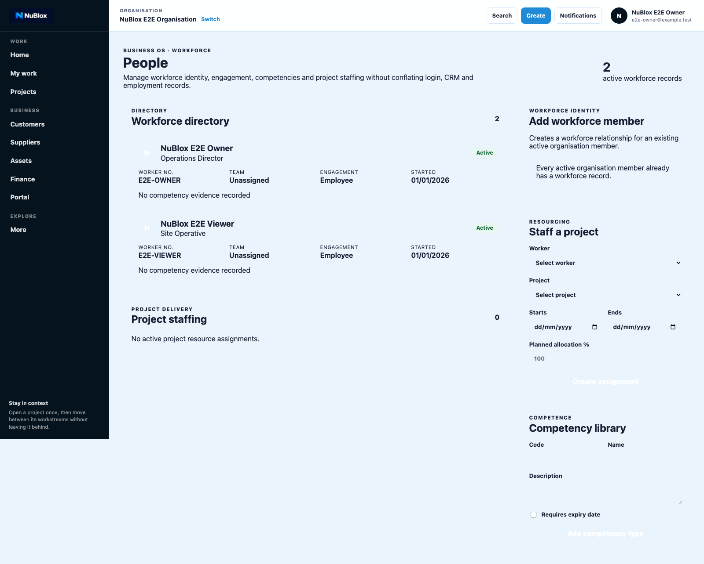
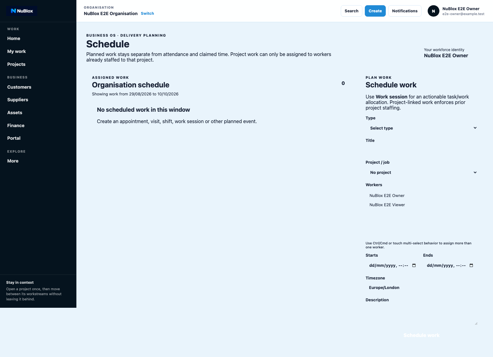
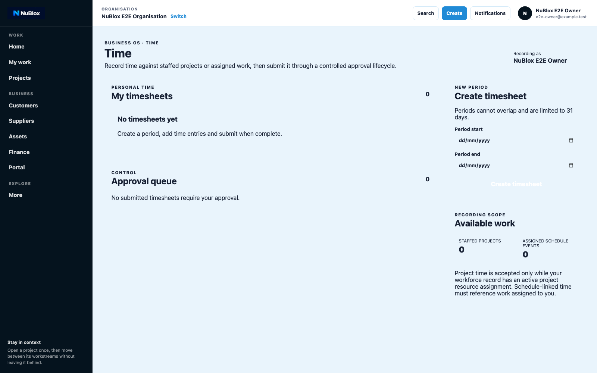
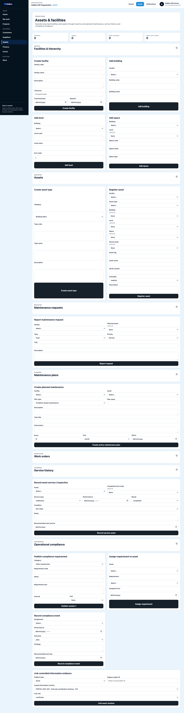
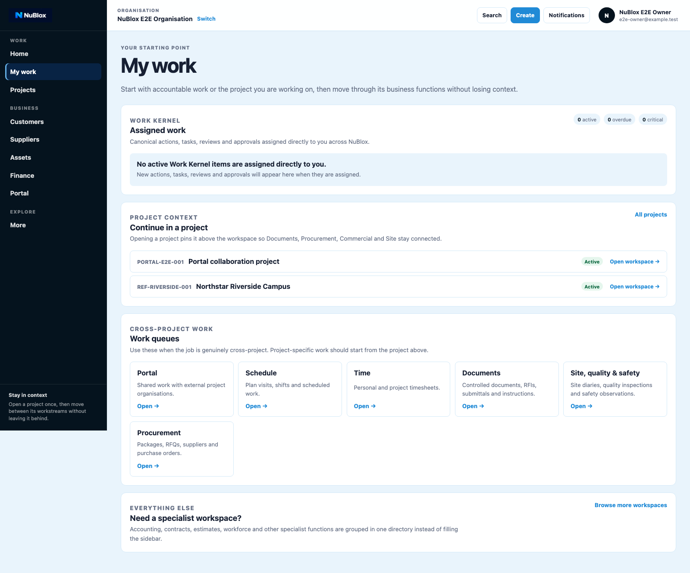

# Domain Guide: Operations, Workforce, and Assets

This guide covers people, schedule, time, and assets/facilities operations.

## A. People

1. Open People.
2. Create or open a workforce member record.
3. Maintain engagement and role attributes.
4. Save and verify workforce status.

## B. Schedule

1. Open Schedule.
2. Create/open scheduled work entries.
3. Assign resources and planned dates.
4. Save and validate sequencing output.

## C. Time

1. Open Time.
2. Create/open timesheet entries.
3. Submit or approve work sessions.
4. Confirm approved status in time register.

## D. Assets and Facilities

1. Open Assets.
2. Create facility/building/asset records.
3. Initiate maintenance requests or plans.
4. Progress service/compliance lifecycle steps.

## E. My Work for Operations Users

1. Open My Work.
2. Filter to due and assigned operational tasks.
3. Open and action tasks in context.
4. Confirm completion state updates.

