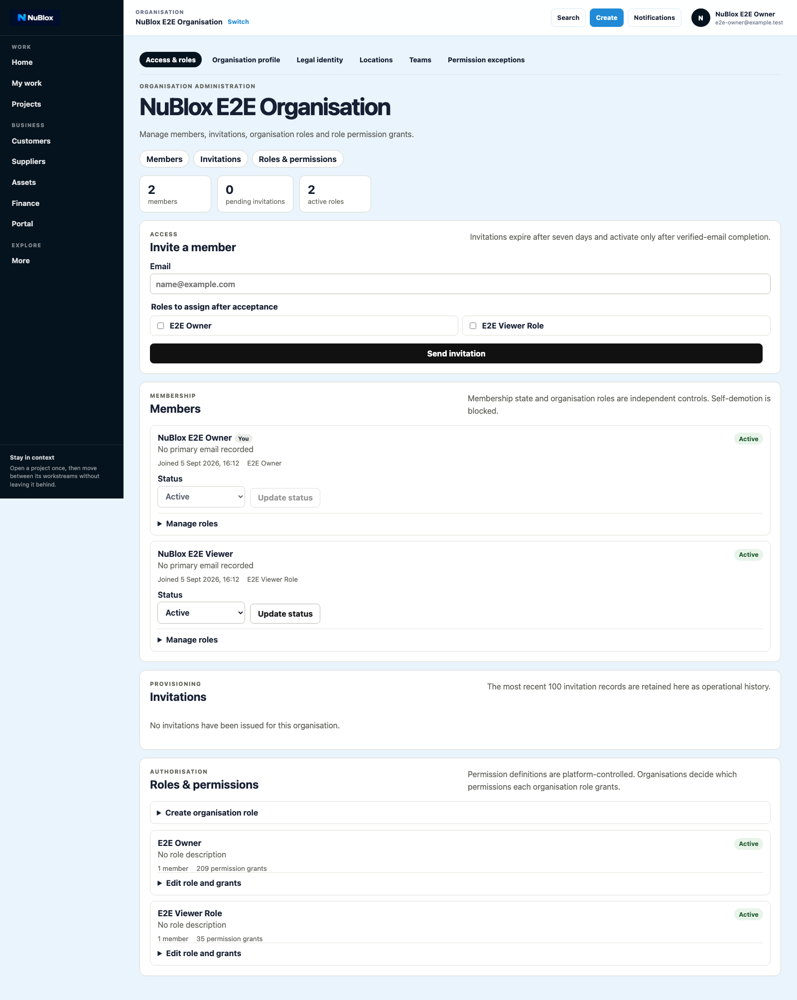
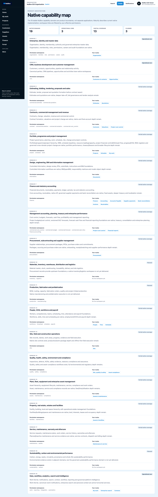

# Domain Guide: Governance and Administration

This guide covers organisation-level governance, member access administration, contexts, and capability map navigation.

## A. Organisation settings

1. Open Organisation.
2. Maintain organisation profile details.
3. Maintain legal identifiers and compliance fields.
4. Save and confirm governance record updates.

## B. Role and member administration

1. In Organisation, open role and invitation controls.
2. Create/update role permissions.
3. Invite members and monitor invitation status.
4. Apply explicit member permission exceptions if required.

## C. Context management

1. Open Contexts.
2. Review recent and favourited contexts.
3. Pin/open context before switching workspaces.
4. Confirm active context persists.

## D. Capability registry

1. Open Capability Registry.
2. Search/filter capability domains.
3. Open linked workspace routes.
4. Confirm route-level access under current permissions.

