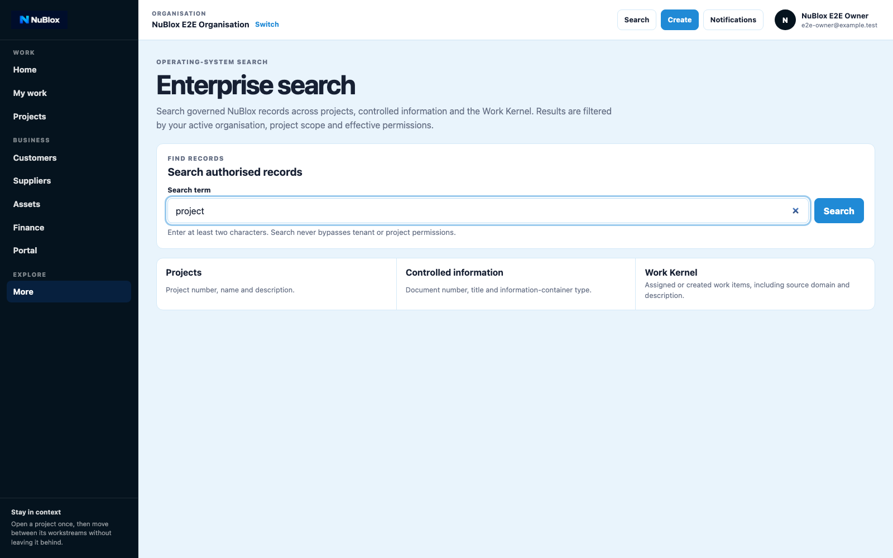
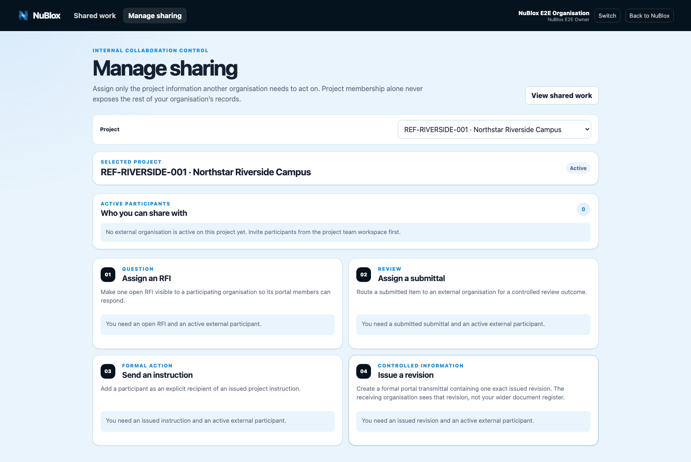
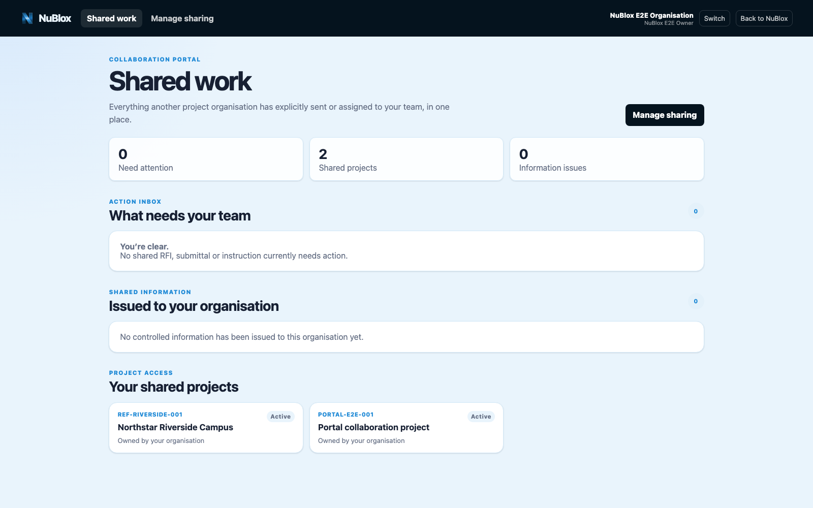
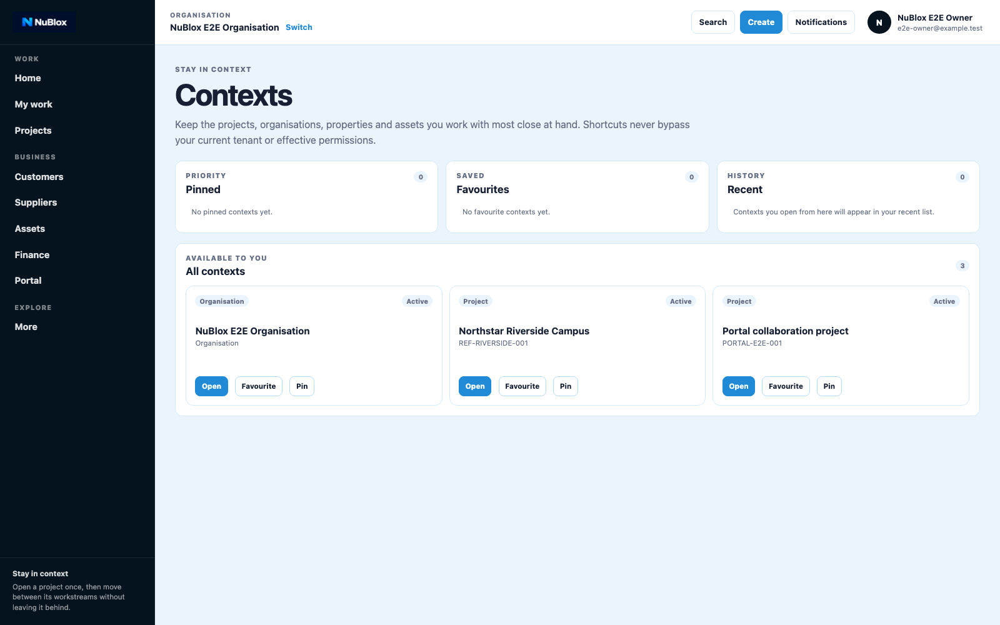

# Domain Guide: Collaboration, Search, and Portal

This guide covers cross-workspace discovery and controlled external collaboration.

## A. Workspace Search

1. Open Search from workspace tools.
2. Enter a workspace keyword.
3. Open a matching result.
4. Confirm navigation into the selected area.

## B. Enterprise Search

1. Open Enterprise Search from More.
2. Enter a query term.
3. Run search and inspect authorised results.
4. Open the relevant record from results.

## C. Portal Manage Sharing (Internal)

1. Open Portal Manage Sharing.
2. Select a project.
3. Assign controlled items (RFI, submittal review, instruction recipient, issued revision).
4. Confirm participant organisation assignment.

## D. Portal Shared Work (External/Partner)

1. Open Portal Shared Work.
2. Review assigned work cards.
3. Complete required responses/acknowledgements.
4. Confirm work card status progression.

## E. Context-aware collaboration

1. Open Contexts and pin the active project/work context.
2. Move between portal/search/workspaces with context preserved.
3. Validate that visible records stay permission-scoped.

