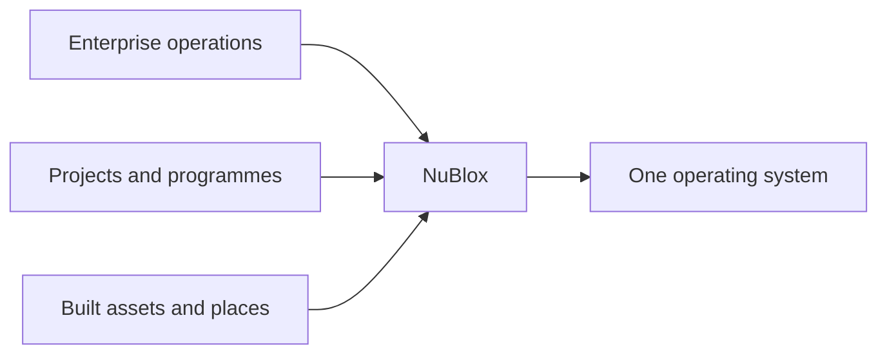

# 01 — Product North Star

**Status:** Governing product proposition  
**Effective:** 27 August 2026

## 1. Proposition

NuBlox is a **complete enterprise operating system for organisations that create, deliver, own and operate the built environment**.

It is deliberately more capable than construction-management software and more sector-aware than generic ERP.

## 2. Three-layer product model

### Layer A — Platform kernel

Shared foundations that make the product coherent:

- identity and authentication;
- tenant, organisation and project context;
- parties and master data;
- permissions, delegated authority and segregation of duties;
- Work Kernel, approvals, notifications and evidence;
- audit, events and reliable downstream integration;
- search, reporting, analytics and intelligence;
- API/import/export/interoperability foundations.

### Layer B — Complete enterprise operations

NuBlox must credibly support the non-construction enterprise as well as the project business:

- strategy and enterprise performance;
- governance, risk, legal and compliance;
- CRM, sales and customer service;
- finance, accounting, treasury and tax;
- procurement and supplier management;
- materials, inventory, logistics and production;
- HCM, workforce and payroll;
- property, facilities, assets and service;
- knowledge, records, data and sustainability.

### Layer C — Construction and Built Environment depth

The sector-specialised layer must go far beyond generic project accounting:

- development and feasibility;
- estimating, measurement and tendering;
- contract and commercial administration;
- portfolio/programme/project controls;
- design, engineering, BIM and CDE;
- construction procurement and subcontracting;
- production, logistics and installation;
- site, field, quality, safety and environmental controls;
- commissioning, handover and golden thread;
- built-asset operations, FM, maintenance and renewal.

## 3. What makes NuBlox different

NuBlox should not win because it has more menu items. It should win because a material business fact remains connected throughout its life.

Examples:

- a won opportunity becomes backlog, contract, project, revenue plan, resource demand and cash forecast without re-keying;
- a worker's competence, project assignment, time, payroll and project cost remain related;
- a purchased component progresses from requirement to receipt, installation, asset record, warranty and maintenance history;
- an approved change carries programme, cost, contract, information and forecast consequences with evidence.

## 4. Product boundaries

### NuBlox owns

For native processes, NuBlox owns the canonical record, lifecycle state, permission model, evidence, workflow and reporting semantics.

### NuBlox interoperates

External systems may provide:

- statutory submission/payment rails;
- specialist authoring, analysis or simulation;
- banking and payment infrastructure;
- specialist sensor/IoT infrastructure;
- open-standard exchange;
- customer-mandated collaboration boundaries.

Interoperability is not an excuse for a permanent missing core capability.

## 5. Benchmark philosophy

World-class vendors are **capability benchmarks**, not architectural templates.

- SAP / Oracle / Dynamics expose enterprise ERP depth expectations.
- Primavera / Unifier expose capital and project-control depth.
- Aconex / Autodesk / Procore expose delivery/CDE/field expectations.
- Teamcenter exposes product/configuration/digital-thread expectations.
- Maximo exposes asset/reliability/service expectations.
- ArcGIS exposes spatial and network-asset expectations.

The question is never “how do we copy their modules?” It is:

> **What materially relevant outcome can a sophisticated customer achieve there that NuBlox cannot yet achieve natively, coherently and with equal or better control?**

## 6. Non-goals

NuBlox must not become:

- a collection of 19 disconnected applications;
- a screen-by-screen implementation of the 29-function taxonomy;
- a generic ERP with construction terminology painted over it;
- a construction PMIS that still needs a separate enterprise system for core operations;
- a data lake of duplicated records with weak transactional authority;
- an over-controlled application whose everyday workflows are too cumbersome to use.

## 7. Product promise

> **Run the enterprise. Deliver the built environment. Operate the asset. Preserve one governed digital thread.**
