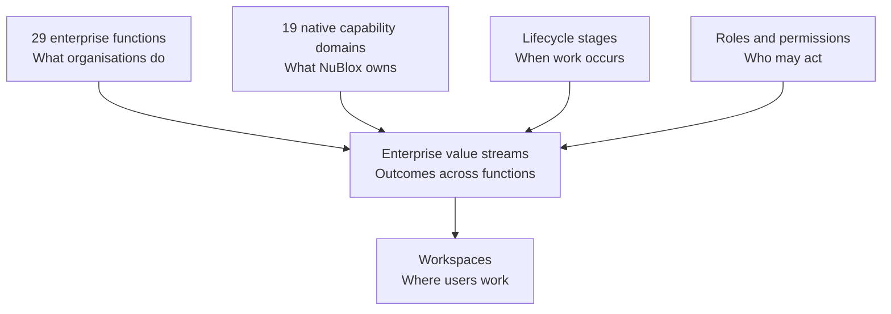

# 02 — Enterprise Operating Model

**Status:** Governing product-composition model  
**Effective:** 27 August 2026

## 1. Why this model exists

NuBlox uses several classifications because no single hierarchy can safely represent enterprise work, product ownership, lifecycle timing, professional context and authority.

The rebaseline therefore keeps these dimensions separate and explicitly mapped.

## 2. Enterprise function taxonomy

The canonical taxonomy contains:

- 29 L1 enterprise functions;
- 353 L2 sub-functions;
- 1,510 source activities;
- an 18-stage generic activity lifecycle.

Its purpose is **coverage and operating-model analysis**. It answers: *what work might an enterprise need to perform?*

It is not:

- a sidebar structure;
- a list of NuBlox modules;
- an implementation sequence;
- permission authority;
- proof that a capability is delivered.

A taxonomy activity becomes a product requirement only through a governed mapping to a material customer outcome, native capability and end-to-end process.

## 3. Nineteen native capability domains

The 19 domains are stable ownership/composition boundaries for native NuBlox capability:

1. Enterprise, identity and master data
2. CRM, business development and customer management
3. Estimating, bidding, tendering, proposals and sales
4. Contracts, commercial management and revenue
5. Portfolio, programme and project management
6. Design, engineering, BIM and information management
7. Finance and statutory accounting
8. Management accounting, planning, treasury and enterprise performance
9. Procurement, subcontracting and supplier management
10. Materials, inventory, warehouse, distribution and logistics
11. Production, fabrication and prefabrication
12. People, HCM, workforce and payroll
13. Site, field and construction operations
14. Quality, health, safety, environment and compliance
15. Plant, fleet, equipment and enterprise asset management
16. Property, real estate, estates and facilities
17. Service, maintenance, warranty and aftercare
18. Sustainability, carbon and environmental performance
19. Data, workflow, analytics, search and intelligence

Domains answer: *which NuBlox capability owns the invariant and transaction?*

They are not intended to become 19 user-facing applications.

## 4. Value streams are the delivery spine

Product sequencing is organised around value streams because customers experience outcomes across several enterprise functions and capability domains.

Examples:

- customer-to-cash crosses CRM, estimating, contracts, finance and analytics;
- source-to-pay crosses procurement, materials, finance and supplier governance;
- design-to-asset crosses project, information, procurement, production, site, quality and assets;
- hire-to-retire crosses identity, HCM, workforce, payroll, projects and finance.

See [`03-enterprise-value-streams.md`](03-enterprise-value-streams.md).

## 5. Lifecycle is orthogonal

The generic 18-stage taxonomy lifecycle describes actions such as Discover, Define, Plan, Design, Request, Review, Decide, Execute, Record, Communicate, Monitor, Analyse, Control, Correct, Improve, Close, Retain and Retire.

The Construction and Built Environment lifecycle provides a sector-specific whole-life thread.

Neither lifecycle is a capability boundary. The same capability may participate at many stages.

## 6. Authority dimensions remain separate

The product keeps these distinctions explicit:

**Career ≠ Organisation Role ≠ Project Role ≠ Permission**

and:

**Enterprise Function ≠ Capability Domain ≠ Value Stream ≠ Lifecycle Stage ≠ Workspace**

This prevents accidental privilege, duplicated records and architecture-by-label.

## 7. Workspace composition

Users should navigate by recognisable work and context:

- organisation;
- customer/supplier;
- opportunity/bid;
- project/programme;
- contract;
- site/location;
- property/building/space;
- asset/system;
- work order/service case;
- information container.

A workspace may compose several domains, but every mutation still resolves to one authoritative domain command.

## 8. Mapping rule

A governed mapping from taxonomy activity to NuBlox implementation should identify, where applicable:

1. enterprise function/sub-function/activity;
2. value stream and business outcome;
3. canonical records;
4. owner domain/service;
5. lifecycle/state transition;
6. tenant/project/record scope;
7. permissions and segregation/delegation controls;
8. work/approval/evidence requirements;
9. downstream commercial/financial/information consequences;
10. workspace;
11. KPI/reporting semantics;
12. tests proving the chain.

Mappings are added to explain real product behaviour, not to manufacture apparent coverage.
