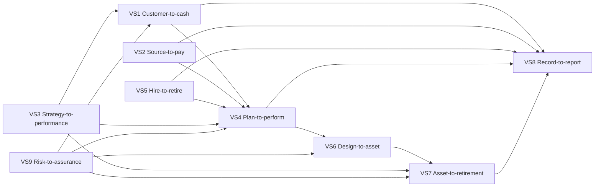

# 03 — Enterprise Value Streams

**Status:** Governing delivery-sequencing model  
**Effective:** 27 August 2026

## 1. Why value streams govern sequencing

The enterprise taxonomy provides breadth and the 19 domains provide ownership. **Value streams provide the order in which NuBlox should prove customer outcomes.**

A value stream is complete only when the user can achieve the intended business outcome across all participating domains without manual re-keying or ambiguous authority.

## 2. Nine reference value streams

### VS1 — Customer-to-cash

```text
Market → Lead → Opportunity → Bid → Estimate → Quote → Contract → Revenue → Invoice → Receivable → Cash → Accounting
```

Primary outcomes: win profitable work, convert it to contractual revenue, bill correctly, collect cash and preserve accounting traceability.

### VS2 — Source-to-pay

```text
Demand → Requisition → Sourcing → Supplier → Contract / Order → Receipt → Verification → Payable → Payment → Ledger
```

Primary outcomes: procure compliant supply at controlled cost, evidence receipt, prevent duplicate/incorrect payment and reflect the commitment/accounting consequence.

### VS3 — Strategy-to-performance

```text
Strategy → Objective → KPI → Target → Initiative → Budget → Actual → Variance → Action → Forecast
```

Primary outcomes: connect strategic intent to funded work, measurable performance and corrective decisions.

### VS4 — Plan-to-perform

```text
Portfolio → Programme → Project → WBS → Schedule → Resources → Execute → Progress → Cost → Forecast → Close
```

Primary outcomes: plan, resource, control and deliver work predictably.

### VS5 — Hire-to-retire

```text
Recruit → Employ / Engage → Develop → Mobilise → Schedule → Time → Pay → Perform → Demobilise → Exit
```

Primary outcomes: maintain a competent workforce, deploy it safely and profitably, pay correctly and preserve people/cost evidence.

### VS6 — Design-to-asset

```text
Requirement → Design → Information → Product / System → Procure / Produce → Install → Verify → Commission → Handover → Installed Asset
```

Primary outcomes: preserve technical intent and configuration into the physical asset and its operational record.

### VS7 — Asset-to-retirement

```text
Asset → Operate → Inspect → Maintain → Service → Condition → Invest → Renew / Refurbish → Decommission → Dispose
```

Primary outcomes: operate safely, maintain availability, optimise lifecycle cost and retain trustworthy history.

### VS8 — Record-to-report

```text
Operational Event → Accounting Consequence → Journal / Ledger → Period → Close → Consolidate → Statement → Management Pack
```

Primary outcomes: make enterprise reporting a traceable consequence of operational facts rather than a parallel data-entry exercise.

### VS9 — Risk-to-assurance

```text
Obligation / Hazard / Risk → Assess → Control → Evidence → Monitor → Issue → Corrective Action → Verify → Assure
```

Primary outcomes: govern risk, compliance, quality, safety and control effectiveness using attributable evidence.

## 3. Relationship between value streams



## 4. Construction specialisation of enterprise streams

NuBlox does not create separate “construction streams” and “ERP streams”. Construction semantics specialise the same enterprise outcomes.

Examples:

- customer-to-cash gains tender adjudication, contract forms, applications, valuations, certification, retention and final account;
- source-to-pay gains procurement packages, subcontract enquiries, site receipt, material traceability and subcontract valuation;
- plan-to-perform gains WBS/CBS/OBS/RBS, CPM scheduling, progress measurement, earned value and controlled project change;
- risk-to-assurance gains RAMS, permits, ITPs, NCRs, design assurance, statutory inspections and golden-thread evidence;
- design-to-asset becomes a first-class built-environment digital thread rather than a file-transfer process.

## 5. Delivery rule

New work should normally strengthen one or more value streams rather than merely make a capability-domain checklist greener.

Before starting a tranche, identify:

- the value stream;
- the broken or missing outcome;
- the canonical upstream and downstream facts;
- the user journey;
- the world-class benchmark gap;
- the measurable acceptance criteria.

This prevents feature accumulation without product coherence.
