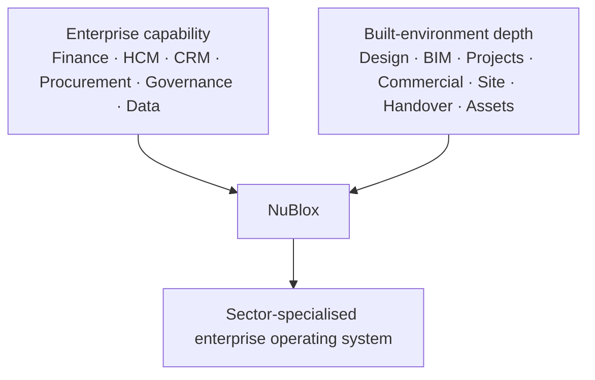

# 04 — Built-Environment Specialisation

**Status:** Governing sector-depth statement  
**Effective:** 27 August 2026

## 1. Sector position

NuBlox must be fully capable of running the non-construction enterprise while being **exceptionally deep for the Construction and Built Environment**.

Construction specialisation is therefore an overlay on a complete enterprise operating system, not a substitute for it.

## 2. What world-class sector depth means

NuBlox must understand material semantics that generic ERP often treats as external project-system concerns:

- development and capital programme context;
- professional appointments and multidisciplinary responsibility;
- estimate/tender structures, measurement and resource build-ups;
- contract-form semantics, notices, change, claims, valuations and final account;
- WBS, CBS, OBS, RBS, location breakdown and schedule structures;
- design responsibility, information requirements and deliverables;
- CDE revision/status/suitability/issue/transmittal/review evidence;
- BIM/openBIM metadata, systems/components and model-object relationships;
- project procurement, subcontracting, site logistics and materials;
- temporary works and controlled technical assurance;
- site diary, labour, plant, delivery and production evidence;
- ITPs, inspection/test records, NCRs, defects and corrective action;
- hazards, RAMS, permits, observations, incidents and investigations;
- commissioning, certification and handover readiness;
- installed-asset configuration, warranties, O&M information and golden-thread evidence;
- whole-life operation, maintenance, refurbishment and decommissioning.

## 3. Dual-depth standard

A NuBlox capability should be assessed on two axes:

| Axis | Question |
| --- | --- |
| Enterprise depth | Could a sophisticated organisation genuinely run this business function in NuBlox? |
| Built-environment depth | Does the capability understand the sector's contractual, project, physical-asset, professional and regulatory semantics? |

Examples:

| Capability | Enterprise depth requirement | Built-environment depth requirement |
| --- | --- | --- |
| Finance | complete ledger, AP/AR, tax, cash, close, reporting | project/job cost, valuations, retention, construction tax/localisation, contract revenue |
| Procurement | supplier lifecycle, requisition, PO, receipt, invoice verification | packages, subcontracting, site receipt, material traceability, supplier compliance |
| HCM | employment, organisation, time, absence, payroll, performance | competence/cards, mobilisation, site/project allocation, labour cost and expiry gates |
| Documents | enterprise records, versions, retention, access | ISO 19650-style CDE semantics, models, suitability, transmittal, design review |
| Assets | hierarchy, maintenance, work, condition, cost | handed-over systems/components, commissioning lineage, statutory evidence, FM context |

A strong score on one axis does not compensate for weakness on the other.

## 4. Organisation archetypes

The same canonical platform must adapt to materially different sector organisations, including:

- developers, investors and asset owners;
- contractors and construction managers;
- specialist subcontractors and trades;
- architects, engineers and design consultancies;
- quantity surveyors and commercial/project-management practices;
- manufacturers, fabricators, merchants and logistics providers;
- infrastructure and utility operators;
- property, estates and facilities organisations;
- maintenance, service and aftercare providers.

Context, configuration and permission alter terminology and relevance; they should not create duplicate core models.

## 5. Standards as overlays

Standards and frameworks such as ISO 19650, IFC/openBIM, Uniclass, RIBA Plan of Work, RICS frameworks, ISO 55000 and applicable building-safety/HSE regimes are versioned overlays.

They may add:

- classifications;
- information requirements;
- validation rules;
- evidence requirements;
- terminology;
- reporting obligations.

They must not create competing identity, project, asset, document or permission models.

## 6. Differentiation target

NuBlox should ultimately make workflows possible that normally require several disconnected systems.

A project manager should be able to understand programme, risk, information, procurement, commercial and field consequences in one governed context. A finance director should see the accounting and cash consequence of that same work. An asset manager should inherit the installed configuration and evidence produced during delivery.

That continuity is the sector advantage.
