# 05 — The NuBlox Digital Thread

**Status:** Governing cross-lifecycle continuity model  
**Effective:** 27 August 2026

## 1. Purpose

NuBlox is not world-class because many capabilities share one login. It is world-class when the same governed business facts remain traceable as they change meaning across enterprise, project and asset lifecycles.

## 2. Primary built-outcome thread

```mermaid
flowchart LR
    O[Market need / opportunity] --> R[Client & project requirement]
    R --> E[Estimate / cost plan]
    R --> D[Design / engineering definition]
    D --> I[Controlled information / model / specification]
    I --> P[Product / system / assembly definition]
    P --> Q[Procurement / production requirement]
    Q --> S[Supplier / material / fabricated component]
    S --> X[Delivery / installation]
    X --> V[Inspection / test / commissioning]
    V --> H[Handover / as-built configuration]
    H --> A[Installed asset]
    A --> M[Operation / maintenance / service]
    M --> U[Renew / refurbish / replace]
    U --> Z[Decommission / dispose]
```



Each transition should preserve provenance rather than replacing one record with an unrelated downstream copy.

## 3. Cross-cutting consequences

The thread carries more than technical information. A material event may have consequences across:

- customer and supplier relationships;
- accountable organisation and actor;
- project/programme/location;
- contract and obligation;
- schedule/activity/work package;
- budget, commitment, actual, revenue, cash and accounting;
- risk, quality, safety and compliance;
- document/model revision and configuration;
- product/material provenance;
- carbon/environmental performance;
- installed asset/system/component history;
- approval, decision and audit evidence.

## 4. Example threads

### Won work

```text
Opportunity
→ accepted quotation
→ executed contract
→ mobilised project
→ backlog / revenue plan
→ resource demand
→ procurement demand
→ cash forecast
→ invoice / receivable
→ ledger / management reporting
```

### Workforce

```text
Person
→ employment / engagement
→ position / organisation relationship
→ competence
→ project assignment
→ resource capacity
→ scheduled work
→ time
→ payroll
→ project actual cost
→ utilisation / margin reporting
```

### Purchased installed component

```text
Design requirement
→ approved product/system definition
→ procurement requirement
→ order
→ receipt
→ delivery to location
→ installation
→ inspection / commissioning
→ installed asset/component
→ warranty
→ maintenance history
→ replacement / disposal
```

### Controlled project change

```text
Change identity
→ scope impact
→ programme impact
→ cost / forecast impact
→ contract impact
→ information impact
→ decision
→ implementation evidence
→ downstream commercial/accounting/reporting consequences
```

## 5. Handover is a critical junction

A strategic priority of the rebaseline is to prove the transition:

**project delivery → commissioned / handed-over configuration → operating asset → maintenance history**.

This junction connects the project-oriented and asset-oriented halves of NuBlox. It is where many conventional software stacks lose traceability.

Handover should not mean uploading a folder of files. It should establish a controlled operational baseline containing the relevant:

- asset/system/component identities;
- location relationships;
- approved/as-built information;
- commissioning and test evidence;
- warranties and service requirements;
- maintenance plans and statutory obligations;
- product/manufacturer provenance;
- unresolved defects/actions where permitted;
- accountable acceptance evidence.

## 6. Digital-thread design rules

1. Prefer relational provenance to copied descriptive fields.
2. Snapshot only when historical evidence requires a stable representation.
3. Do not overwrite issued, approved, posted or accepted history.
4. Downstream consequences should reference their source event/record where practical.
5. Cross-domain linkage must not permit one domain to mutate another domain's authority directly.
6. Reporting must drill through to authoritative facts.
7. Imported/external information must retain provenance and source identity.
8. AI/automation may interpret or propose actions but must operate through authorised domain commands.

## 7. Digital-thread completeness test

For a material customer outcome, a reviewer should be able to start at either end and answer:

- Where did this fact come from?
- Who approved or changed it?
- Which requirement/contract/project/location/asset does it belong to?
- What downstream consequences did it cause?
- What is the current authoritative state?
- What evidence proves the transition?

If those questions require manual reconciliation across disconnected NuBlox records, the thread is incomplete.
