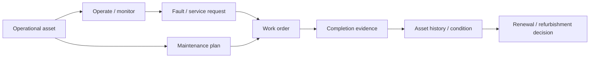

# 08 — Reference Journeys

**Status:** Governing product-proof journeys  
**Effective:** 27 August 2026

## 1. Purpose

NuBlox needs a small number of stable, representative journeys that prove the product works as one operating system rather than a collection of capable areas.

These journeys do not replace domain tests. They sit above them and prove cross-domain continuity, experience quality and digital-thread integrity.

## 2. Journey A — Win work, deliver it and get paid

### Scenario

A contractor identifies an opportunity, prices the work, agrees a contract, mobilises a project, plans and delivers it, controls change/cost, values work, invoices the customer and closes the financial position.

### Must prove

- canonical customer/opportunity provenance carries downstream;
- estimate/quote/contract/project transitions are controlled and idempotent;
- project budget, commitments, actuals, progress and forecast reconcile;
- approved change can link scope/programme/cost/contract/information impact;
- valuation/revenue/billing events connect to finance rather than duplicate value;
- management reporting drills through to source evidence;
- user context is preserved across project workstreams;
- rejection, correction and closure paths exist.

## 3. Journey B — Requirement to handed-over operating asset

### Scenario

A client/project requirement drives design information and responsibility, procurement/production and installation, inspection/commissioning, handover and creation/confirmation of the operational asset baseline.

### Must prove

- requirements map to responsible project roles and controlled deliverables;
- issued design information remains revision/suitability/purpose controlled;
- design/product/system identity links to procurement/production and installed configuration;
- inspection/test/commissioning evidence is attributable;
- handover validates required information and unresolved exceptions;
- operational asset/system/location relationships are established without re-keying the project history;
- warranties, maintenance requirements and compliance obligations carry forward;
- asset managers can trace back to project/design/commissioning evidence.

This is the **signature NuBlox digital-thread journey**.

## 4. Journey C — Operate, maintain and renew an asset

### Scenario

An asset owner/operator receives the handed-over asset, operates it, responds to faults, performs planned/statutory work, tracks condition and lifecycle cost, and makes a renewal/refurbishment decision.

### Must prove

- asset identity, location and configuration originate from governed records;
- service requests and maintenance plans create controlled work;
- workforce, parts/materials, contractor and cost consequences can be linked;
- statutory inspections and compliance evidence remain visible;
- failure/condition/history support lifecycle decisions;
- project work can be initiated for major refurbishment without losing asset history;
- financial and management reporting reflect lifecycle cost.

## 5. Supporting enterprise proof journeys

The three primary journeys are supplemented by focused enterprise journeys where deeper proof is needed:

- source-to-pay;
- hire-to-retire;
- record-to-report;
- strategy-to-performance;
- risk-to-assurance.

These should share canonical facts with the primary journeys rather than operate as isolated demonstrations.

## 6. Golden reference enterprise/project

NuBlox should maintain a stable reference scenario representing a realistic built-environment enterprise and project. It should contain enough complexity to exercise:

- customer and supplier organisations;
- internal workforce and external participants;
- a project with programme/WBS/cost structures;
- design/information requirements;
- procurement and commercial change;
- site/quality/safety evidence;
- commissioning/handover;
- installed assets and maintenance;
- finance and management reporting.

New major capability should prove how it improves this reference scenario.

## 7. Journey acceptance gate

A reference journey is only green when it demonstrates:

1. canonical identity continuity;
2. server-authoritative permissions/scope;
3. lifecycle and exception behaviour;
4. audit/evidence provenance;
5. cross-domain consequences;
6. reporting/drill-through;
7. usable context-preserving experience;
8. real database integration proof;
9. browser-level acceptance;
10. no manual re-keying that represents an architectural gap.
