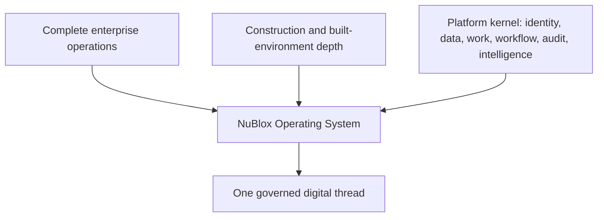

# World-Class NuBlox Operating System Rebaseline

**Status:** Governing product-strategy and delivery compass  
**Effective:** 27 August 2026  
**Scope:** NuBlox: Digital Applications

## Product definition

**NuBlox is a world-class enterprise operating system engineered for organisations that create, deliver, own and operate the built environment.**

It must be exceptionally capable at both:

1. **running the enterprise** — strategy, customers, finance, people, procurement, supply chain, production, property, assets, service, governance, data and performance; and
2. **running the built-environment lifecycle** — work winning, briefing, design, engineering, estimating, contracting, project controls, commercial management, procurement, production, site execution, quality, safety, commissioning, handover, operation, maintenance, refurbishment and retirement.

The differentiator is not the number of modules. It is the continuity of governed business facts across enterprise, project and asset lifecycles.

## Target state versus implemented state

The **target state** describes what NuBlox is being engineered to become. The **implemented state** is what the current code, migrations, tests and live workspaces prove today.

These must never be conflated.

- Architecture and product documents may define target capability.
- The capability registry and runtime process map describe current maturity.
- GitHub issues and pull requests describe delivery status.
- A capability is not “world-class” because it appears in a document or has a screen.

See [07-world-class-baseline.md](07-world-class-baseline.md) and [10-capability-control-matrix.md](10-capability-control-matrix.md).

## Authority map

| Concern | Authority |
| --- | --- |
| Product ambition, value streams and delivery priorities | this `docs/world-class/` suite |
| Bottom-up architecture and invariants | [`../architecture/bottom-up/README.md`](../architecture/bottom-up/README.md) |
| Target-state market/category breadth | [`../architecture/bottom-up/platform-coverage-contract.md`](../architecture/bottom-up/platform-coverage-contract.md) |
| Construction and Built Environment domain model | [`../construction-and-built-environment.md`](../construction-and-built-environment.md) |
| Enterprise work taxonomy | [`../architecture/taxonomy/README.md`](../architecture/taxonomy/README.md) and its JSON shards |
| Native capability ownership | Layer 6 and `app/src/lib/navigation/capability-registry.ts` |
| External benchmark challenge | this suite plus benchmark registers such as [`../sap-capability-coverage-register.csv`](../sap-capability-coverage-register.csv) |
| Implemented schema | committed MySQL migrations |
| Runtime behaviour | domain services, repositories and tests |
| Delivery status | GitHub issues, PRs and CI |

No document in this suite replaces the bottom-up architecture. This suite governs **why and in what order** NuBlox is developed; the bottom-up architecture governs **how capability is safely engineered**.

## Core product invariants

1. **One complete product.** Market categories are benchmarks, not NuBlox module boundaries.
2. **Enterprise breadth and sector depth.** Back-office capability must be ERP-class; built-environment capability must be industry-deep.
3. **One canonical business fact.** Do not create separate truths because different teams or lifecycle stages need the same concept.
4. **Digital thread over module integration.** Upstream facts must remain traceable through downstream consequences.
5. **Context and authority shape experience.** Capability included ≠ capability visible ≠ capability authorised.
6. **Career ≠ Organisation Role ≠ Project Role ≠ Permission.**
7. **World-class includes usability.** Strong controls delivered through cumbersome workflows are not complete.
8. **No happy-path-only capability.** Rejection, correction, reversal, dispute, concurrency and evidence matter.
9. **Construction is the deepest specialisation, not the entire enterprise boundary.**
10. **Current maturity must stay honest.** Planned and partial capability must not be presented as fully delivered.

## The rebaseline suite

1. [`01-product-north-star.md`](01-product-north-star.md) — product proposition, boundaries and benchmark philosophy.
2. [`02-enterprise-operating-model.md`](02-enterprise-operating-model.md) — how taxonomy, capability, lifecycle, roles and workspaces fit together.
3. [`03-enterprise-value-streams.md`](03-enterprise-value-streams.md) — the end-to-end enterprise processes that drive delivery sequencing.
4. [`04-built-environment-specialisation.md`](04-built-environment-specialisation.md) — what makes NuBlox exceptional for the sector without weakening enterprise breadth.
5. [`05-digital-thread.md`](05-digital-thread.md) — continuity from demand and requirement to asset retirement.
6. [`06-world-class-experience.md`](06-world-class-experience.md) — the experience standard for office, project, field and operational users.
7. [`07-world-class-baseline.md`](07-world-class-baseline.md) — honest current-state maturity and the largest gaps.
8. [`08-reference-journeys.md`](08-reference-journeys.md) — golden journeys used to prove the operating system works as one product.
9. [`09-delivery-governance.md`](09-delivery-governance.md) — prioritisation, completeness scoring and repository governance.
10. [`10-capability-control-matrix.md`](10-capability-control-matrix.md) — the evidence-led 19-domain × value-stream × golden-journey control matrix and current World-Class readiness.
11. [`11-sap-benchmark-coverage.md`](11-sap-benchmark-coverage.md) — how the 64-reference SAP coverage register challenges enterprise breadth without becoming NuBlox architecture or delivery sequencing.

## North-star outcome

NuBlox succeeds when a sophisticated organisation can run its enterprise, projects and built assets without re-keying the same business facts into disconnected systems, while every material decision remains attributable, permission-aware, auditable and usable.